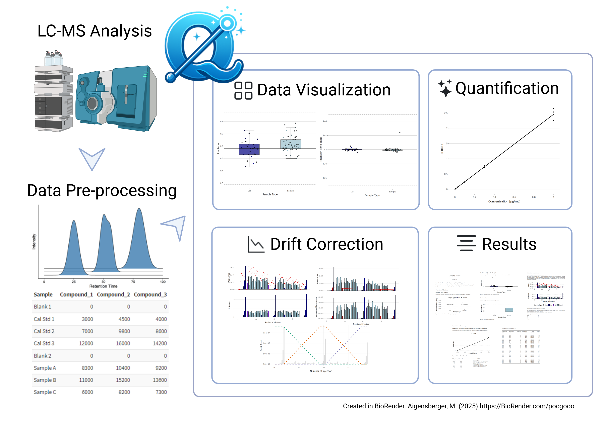

<table style="border-collapse: collapse; border: none; margin: 0; padding: 0;">
  <tr>
    <td style="border: none; padding: 0; vertical-align: middle;">
      
    </td>
    <td style="border: none; padding: 0; vertical-align: middle;">
      <h1 style="font-size: 100px; margin: 0;">QuantyFey</h1>
    </td>
  </tr>
</table>

# **Project Overview**

**QuantyFey** is a Shiny application for the **visualization, analysis, and quantification** of **mass spectrometry (MS) data** using **external calibration**.  
It is specifically designed to address **intensity drifts** in datasets, offering multiple **correction strategies** to ensure accurate quantification.  
QuantyFey is compatible with **Windows** operating systems only.

## **Target Audience**

QuantyFey is intended for users with a basic understanding of mass spectrometry and data analysis, including:  
- **Analytical chemists** conducting MS data quantification.  
- **Laboratory technicians** processing MS results in research or industrial settings.

## **Key Features**

QuantyFey provides:
- commonly applied **drift correction** methods:
    - **Internal Standard (IS) correction**
    - **Drift Correction** using statistical models
    - **Custom Bracketing** Quantification (Assigning calibration data to predefined blocks of the sequence).
    - **Weighted Bracketing** Weighting of calibration curves based on the position of the samples between calibration curves.
- **Interactive Regression Model Optimization** - manual adjustment of model, weights, standard levels etc.
- **Automatic Optimization Module** - automatic selection of **linear** or **quadratic** regression model, and selection of appropriate standards.

---
# **Quick Installation Guide**

## Standalone Version

The standalone version [QuantyFey](https://github/CDLMarkus/QuantyFey/releases/) only works on **Windows** systems. It runs on R-portable 4.2.0 and runs locally on the user's computer.

### **Prerequisites**
- **RTools**: Version 4.2 must be installed.

### Apptainer Version
The apptainer version is recommanded for running on **Linux** systems. For MacOS Systems, this version is generally slow and difficult to setup. 
Here, only the installation for **Linux** systems will be discussed, referr to the file [Apptainer_tutorial.md](/tutorial/Apptainer_tutorial.md) for more information.

#### Prerequisites
- Install [Apptainer](https://apptainer.org/docs/admin/main/installation.html#install-from-github-release-rpms)

#### Launch and bind directory
Launch the apptainer by using the `launch_quantyfey.sh` file.

## Launch QuantyFey from your local R, or RStudio
> **Note:** The launch directly from R with appropriate package control only works on R 4.2.x or the R 4.5.x versions.

Windows: current version of RTools for your R version
Linux: multiple prerequisites - referr to the [`tutorial`](/tutorial/tutorial.md) for more information
Mac: no additional prerequisites required

1. Download the github repository
2. Open the `app.r` script
3. Set the current working directory to the `app.r` location
  ``` r
  setwd("path_to_QuantyFey_app.r")
  ```
4. Run the entire script (Ctrl+A; Ctrl+Enter)


---

> Refer to the [`tutorial`](tutorial/tutorial.md) for a more information on installing and using **QuantyFey**.


## **Installation Standalone Version**

1. Download the zip file download [QuantyFey.zip](https://github.com/CDLMarkus/QuantyFey/releases/)
2. Extract the folder to a desired location.
3. Navigate to the `QuantyFey` folder and execute `QuantyFey.bat` (Windows only)(approval may be required).
4. The console will open, and all required packages will be installed automatically (this process may take up to 10 minutes).
5. Once installation is complete, the application will launch in your default web browser.

## **Installation Apptainer**

A standalone version based on **Apptainer** is available for download.
This comes with mutliple batch files for installation of wsl, apptainer and other required packages - as well as a launch script (as shell for Linux or batch for Windows).

As this installation and lauch is complicates, please referr to the [`tutorial`](/tutorial/tutorial.md) for detailed information.

> **Note:** For Windows the standalone version is preferred - as writing output is not as easily done with the apptainer version.

---

## **Overview**


---

# **Using the App**

Discription of the app and tutorials on how to effectively use it can be found in the [tutorial](tutorial/tutorial.md).
The app provides the user the tools for versatile and interactive quantification of targeted Mass Spectrometry Data using external calibration. Especially when Intensity Drift is observed during the Measurement, the app provides the user with tools to effectively handle these drift. This app works as an additional software to already integrated mass spectrometry data, and does not provide any integration cabailities, but rather offers the user an interactive tool for efficient quantification.




