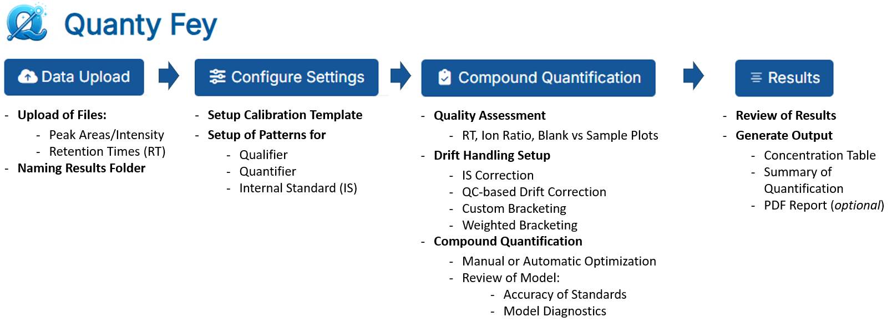

<table style="border-collapse: collapse; border: none; margin: 0; padding: 0;">
  <tr>
    <td style="border: none; padding: 0; vertical-align: middle;">
      
    </td>
    <td style="border: none; padding: 0; vertical-align: middle;">
      <h1 style="font-size: 100px; margin: 0;">QuantyFey</h1>
    </td>
  </tr>
</table>

# **Project Overview**

**QuantyFey** is a Shiny application for the **visualization, analysis, and quantification** of **mass spectrometry (MS) data** using **external calibration**.  
It is specifically designed to address **intensity drifts** in datasets, offering multiple **correction strategies** to ensure accurate quantification.  
QuantyFey is compatible with **Windows** operating systems only.

## **Target Audience**

QuantyFey is intended for users with a basic understanding of mass spectrometry and data analysis, including:  
- **Analytical chemists** conducting MS data quantification.  
- **Laboratory technicians** processing MS results in research or industrial settings.

## **Key Features**

QuantyFey provides:
- commonly applied **drift correction** methods:
    - **Internal Standard (IS) correction**
    - **Drift Correction** using statistical models
    - **Custom Bracketing** Quantification (Assigning calibration data to predefined blocks of the sequence).
    - **Weighted Bracketing** Weighting of calibration curves based on the position of the samples between calibration curves.
- **Interactive Regression Model Optimization** - manual adjustment of model, weights, standard levels etc.
- **Automatic Optimization Module** - automatic selection of **linear** or **quadratic** regression model, and selection of appropriate standards.

---
# **Quick Installation Guide**

## **Prerequisites**
### **Windows**:
- **RTools**: Version 4.2 must be installed.
 
### **Linux**

Multiple packages are required for **Quanty Fey** to run smoothly on Linux. Make sure all of them are installed. Refer to the [tutorial](tutorial/tutorial.md) for more informaiton.

### **Mac**

Not working as a standalone application on iOS. Can be run locally using **R**, or **RStudio**.

---

> Refer to the [`tutorial`](tutorial/tutorial.md) for a more information on installing and using **QuantyFey**.

## **Installation**

1. Download the zip file download [QuantyFey.zip](https://github.com/CDLMarkus/QuantyFey/releases/)
2. Extract the folder to a desired location.
3. Navigate to the `QuantyFey` folder and execute `QuantyFey.bat` (approval may be required).
4. The console will open, and all required packages will be installed automatically (this process may take up to 20 minutes).
5. Once installation is complete, the application will launch in your default web browser.

## **Overview**

---

# **Using the App**

Discription of the app and tutorials on how to effectively use it can be found in the tutorial folder.
The app provides the user the tools for versatile and interactive quantification of targeted Mass Spectrometry Data using external calibration. Especially when Intensity Drift is observed during the Measurement, the app provides the user with tools to effectively handle these drift. This app works as an extra software to already integrated mass spectrometry data, and does not provide any integration cabailities, but rather offers the user an interactive tool for efficient quantification.

