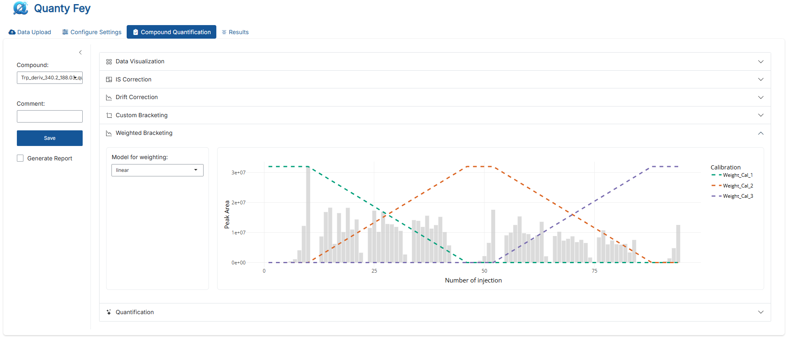
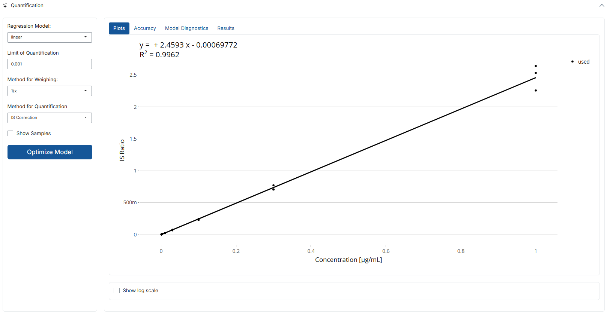
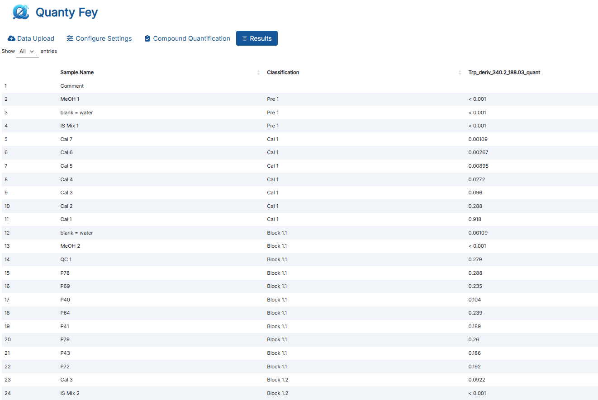

## **Tutorial**
This tutorials explains how to use the **QuantyFey** application, step by step. It covers everything you need to get started and use it efficiently. QuantyFey is designed to quantify targeted LC-MS/MS data using external calibration, but can also be used with other data formats that include intensity and retention time values.

### **Table of Contents**

- [Installation](#installation)
  - [Prerequisites](#prerequisites)
    - [Windows](#windows)
  - [Standalone installation](#standalone-installation)
  - [Installation for launching the app using RStudio](#installation-for-launching-the-app-using-rstudio)
- [Notes before using your own data](#notes-before-using-your-own-data)
- [Application Structure](#application-structure)
  - [Data Upload](#data-upload)
  - [Configure Settings](#configure-settings)
  - [Compound Quantification](#compound-quantification)
    - [Data Visualization](#data-visualization)
    - [Drift Correction](#correcting-for-intensity-drift)
      - [IS Correction](#is-correction)
      - [Drift correction](#drift-correction)
      - [Custom Bracketing](#custom-bracketing)
      - [Weighted Bracketing](#weighted-bracketing)
    - [Quantification](#quantification)
    - [Saving Results](#saving-results)
  - [Results](#results)
- [Summary](#summary)
- [Troubleshooting](#troubleshooting)


### **Installation**
The standalone version of this application runs on **Windows** and **Linux**. You can also run it directly from **R**, **RStudio**, or **VS Code**, which makes it compatible with **macOS** as well.

#### Prerequisites

##### Windows
- **RTools 4.2** is required:
  - **Option A**: Install from the [official CRAN page](https://cran.r-project.org/bin/windows/Rtools/rtools42/rtools.html).
  - **Option B**: Use the included Portable R:
    - Navigate to `R-portable/bin/` and launch `R.exe`
    - Run the following in the R console:
      ```r
      install.packages("installr", repos = "https://cloud.r-project.org/")
      installr::install.Rtools()
      ```
    - Do not update the R version if prompted.
    - Follow the installer instructions. You can ignore any non-critical error during the final steps.


#### **Standalone Installation**

- **Download** the latest version of [QuantyFey](https://github.com/CDLMarkus/QuantyFey/releases/)
- **Unzip** the folder to a destination of your choice.
- **Run** the batch (Windows) file to start the App.
> **Note:** you may need to approve the execution of the script on Windows
- A console will open and first all requirec packages will be installed automatically


#### **Installation for launching the app using RStudio**
- **Download** the GitHub repository.
- **Unzip** the files to a destination of your choosing.
- **Install** [R](https://cran.r-project.org/)
  > **Make sure R version 4.2.x is installed; versions > 4.5 might be troublesome for installing packages!**
- **Install** [RStudio](https://posit.co/download/rstudio-desktop/)
- **Install** [pandoc](https://pandoc.org/installing.html)
- **Install** prerequisites as mentioned above.
- **Open** `app.R` and **run** the script


> **Note**: On first launch, the app uses the `renv` package to restore the required R package environment. This enusres compatibility by installing the correct package versions. This process may take up to 20 minutes.

---

### **Notes before using your own data**

The application comes with a test dataset based on LC-MS/MS data. This is included to help you get started and explore the app's features.

> **Important:** The app is preconfigured to work with these test datasets. This includes predefined **Calibration Standard Names** and their **Concentrations**. Before using your own data, you'll need to update this setup.

To adjust the configuration:
1. Open the file at `Dependencies/templates.xlsx`
2. Add a new sheet or edit an existig one to define your own analysis setup.

**Template Structure Requirements**
The template must follow this structure exactly:
- `Cal.Name`: The first column must be named `Cal.Name` (spelling and case-sensitive). It should list the **names of the Calibration Standards** used in your sequence.
- `Concentration`: The second column should specify the **concentration** for each corresponding **Calibration Standard**.
You may also define concentrations at the **transition level** (e.g., different concentrations for every single transition). In that case:
- Every single **quantifier transition name must be included in the template**.
- Refer to the worksheet `ExampleAllCompounds` in the [templates.xlsx file](../Dependencies/templates.xlsx)

The app uses this file to **map the concentrations** of the Calibration standards to their corresponding names in the dataset. The concentrations are used for compound quantification.

> **Note:**
> Standard names in the template **must exactly** match those in the sequence (**case-sensitive**):
> - Standard names are the names in the `Sample.Name` column of your Peak Area Table that are classified as `Standard` or `Cal` in the `Sample.Type` column.
> - Refer to the [Example Peak Table](<../Example Datasets/Example_Areas.txt>).
> 
> If any standard that is defined in your data (**Sample.Type column**) is not included in this template, it will be appended with a concentration of **0** - and will not be included in the quantification process.
> 
> If not all quantifier transitions are present in the template, errors can occur. Please mind the pop-up messages while selecting the quantification template!


## **Application Structure**

The app is divided into multiple tabs, each with a specific function. This layout guides users through the analysis process step by step.


---
### **Data Upload**

In the **Data Upload**, you need to import the two data files required for analysis - **Peak Intensity** values and **Retention Times** (RT). These files must be uploaded in **csv**, **txt**, or **xlsx** format using standard delimiters (`,`, `;`, `:`, or tab `\t`):


#### **1. Peak Table**

This file contains **peak intensity data** (e.g., *Peak Areas* or *Peak Heights*) for the measured compounds. The required structure is as follows:

- `Sample.Name`: Identifier for each sample.
  > **Note:** Avoid numerals at the first position of the name, and avoid special characters.
- `Sample.Type`: Must be one of the following (case-sensitive):
  - `Sample` – Experimental samples.
  - `Standard` or `Cal` – Calibration standards.
  - `Blank` – Blank samples for background correction.
  - `QC` – Quality control samples.
- `Classification` *(optional)*: Defines distinct sequence blocks for **custom bracketing analysis**.
  - Calibration standards must follow the pattern `Cal n` (e.g., `Cal 1`, `Cal 2`, ...).
  - Sample blocks may be named freely (e.g., `Sample Block 1`, `Block A`).
  > **Note**: If this column is missing, it will be auto-generated:
  >  - Calibration curves are identified as three or more consecutive standards (as defined in `Sample.Type` column).
  >  - Sample blocks are defined between these curves.
  >  - Samples before the first calibration are labeled `Pre 1`.

> **Important**
> - Missing or incorrectly formatted columns will lead to an error massege and upload will be halted.
> - If internal standards are not recognized by the default pattern, a warning message will appear and internal standard correction features will be disabled.
>   By updating the internal standard pattern these features can be restored.

##### Example Table: Peak Table Format

Example file: `Example_Datasets/Example_Areas.txt`


#### **2. Retention Time Table**

This file provides **retention time (RT)** data for the compounds.
> **Note:** The upload button will only appear after the **Peak Table** was uploaded.

- Must include a `Sample.Name` column identical to that in the Peak Table.
- Only compounds present in the Peak Table will be considered.
- Upload the RT Table **after** the Peak Table.
> **Note:** the app will ignore any additional columns that aren't needed.

##### Example Table: Retention Time Table Format

Example file: `Example_Datasets/Example_RT.csv`


#### **3. Project Name (optional)**

You may optionally enter a **Project Name**, which will be used to label output folders.

- Output will be saved in the user's **Documents** folder under:  
  `Documents/QuantyFey/<ProjectName>/`

#### **4. Reset the Application**

Click **Reset App** to restart the session and clear all uploaded data — useful if the wrong files were selected or you want to begin a new analysis.

#### Summary: Minimum Upload Requirements

| File                | Required Columns                        | Notes                                                       |
|---------------------|------------------------------------------|-------------------------------------------------------------|
| **Peak Table**      | `Sample.Name`, `Sample.Type`             | Optional: `Classification`; supports multiple transitions per analyte.  |
| **RT Table**        | `Sample.Name`, transitions from Peak Table | Must match Peak Table sample names.                         |

---

### **Configure Settings**

#### **Selecting Quantification Template**
To perform quantification, you need to select the appropriate template. Use the dropdown menu in the app to choose from available sheets in the `templates.xlsx` file. Each sheet represents a separate template.
When selected, the left pane will be updated with the respective template. If the template encompasses all transition names, it will show the concentrations of the selected compound.

> **Note:**
> Make sure the correct template is selected - quantification will not work if the template does not match your data or the wrong sheet is chosen.
> Refer to [`Notes before using your own data`](#notes-before-using-your-own-data) for more information how to add your template the the `tamplets.xlsx` file.

#### **Change patterns**
QuantyFey automatically detects **Quantifier**, **Qualifier**, and **Internal Standard (IS)** transitions by searching for predefined patterns in the column names of the Peak Table. These patterns can be customized to match your dataset's naming.
Patterns can be changed by selecting the `Change Patterns` Checkbox. Then three inputs will be shown, that can be adjusted.

> **Tip:** You can set default values by modifying the `default_settings.R` file, or override them directly within the app interface.

---

#### **Default Pattern Setup (*in `default_settings.R`*)**

Below are the default settings used by the app. You can change them in the `default_settings.R` (using RStudio, VS Code, or the text editor) file.

| Setting         | Default Value | Description                                                |
| --------------- | ------------- | ---------------------------------------------------------- |
| `quant_pattern` | `_quant`      | Identifies quantifier transition columns                   |
| `qual_pattern`  | `_qual`       | Identifies qualifier transition columns                    |
| `IS_pattern`    | `IS`          | Identifies internal standard transition columns            |
| `conc_unit`\*   | `µg/mL`       | Unit used for concentration in plots and tables            |
| `int_unit`\*    | `NULL`      | Unit used for intensity values in outputs                  |
| `rt_unit`\*     | `min`         | Unit used for retention time                               |
| `Template_name` | `Example1`    | Default name of the template used for quantification setup |

> **\*** These unit values can only be adjusted in the default_settings.R file and are not editable from within the app interface.


##### Code (as seen in `default_settings.R`)

```r
## Setup Default Settings for QuantyFey

# Default Template name
Template_name = "Example1" 
# Pattern for Quant Transition:
quant_pattern = "_quant"
# Pattern for Qual Transition:
qual_pattern = "_qual"
# Pattern for IS Transition:
IS_pattern = "IS"

#### ---- Units ---- ####
# Set to NULL if you don't want to show the unit in the plot
# Concentration 
conc_unit = "µg/L"
# Intensity Unit
int_unit = NULL
# RT Unit
rt_unit = "min"
```

> **Note:** Updating the units helps ensure consistency between your dataset and the visualization/output displays in the app.

---

### **Pattern for Quantifier Transitions**

This pattern identifies **quantifier** transitions from Peak Table column names.

- Supports **regular expressions** (*Regex*)
- Only columns matching this pattern (and **not** matching the IS pattern) will be used for quantification.

#### Regex Examples:
- `^Compound1_` → Columns starting with `Compound1_`
- `_quant$` → Columns ending with `_quant`
- `Compound[0-9]+_` → Matches names like `Compound1_`, `Compound2_`, etc.
- `^Cal.*ppb$` → Columns starting with `Cal` and ending with `ppb`


> **Important: Understanding Regular Expressions**
> - `.` matches any single character.
> - `*` means zero or more of the previous character.
> - `^` anchors the match to the start of the text.
> - `$` anchors the match to the end of the text.
> - `.*` matches any number of any character.
> - To match a literal `.` or `*`, escape it with a backlash: `\.` or `\*`.
> - For more information check out this [Regex Quick Reference](https://hypebright.nl/en/r-en/ultimate-cheatsheet-for-regex-in-r-2/).


### **Pattern for Qualifier Transitions**

Defines how **qualifier** transitions are detected.

- Also uses **regular expressions**
- Matches are determined based on the **prefix** of the corresponding quantifier transition.

#### Prefix Matching Logic:
- The **prefix** is the string before the first underscore (`_`)
- Example formats:
  - `CompoundID_Q1_Q3_CE_quant`
  - `CompoundID.Q1_Q3_CE_qual`

> If no matching qualifier transitions are found, the **Qualifier/Quantifier Ion Ratio Analysis** tab will be hidden.

### **Pattern for IS Transitions**

This pattern identifies **internal standard** transitions.

- Supports **regular expressions**
- Matching columns will:
  - be **excluded** from quantification
  - be **used** for IS correction (if enabled)

> If no IS transitions are detected, IS correction will be disabled automatically and a warning message will appear.


---

### **Compound Quantification**
The **Compound Quantification** tab is the main workspace for **visualization**, **drift correction**, **regression model optimization**, and **quantification**. 

#### **Setup**


In the left-side panel, users can configure the following:
- **Compound**: Select the quantification transition.
- **Comment**: Add notes for the quantification process.
- **Save**:
    - Ouput is saved to user's **Documents** folder
    - If the default path fails (e.g., due to permissions), results are saved to the local QuantyFey directory.
    - Files are placed inside a folder names `Results_<date>` unless a different name is specified as **Project Name** in the **Data Upload** tab.
    - Two output files are created and updated with each save:
      - A **concentration table** (`Results_quant.xlsx`) showing concentrations and comment for each compound saved.
      - A **summary file**  (`Quant_summary.xlsx`) listing all parameters and settings, with one sheet per save.

- **Generate Report**: Optional checkbox. If enabled, a PDF report will be created containing all plots and a summary of the quantification.

> **Note on File Management:**
> To avoid overwriting while limiting file clutter:
> - Concentration tables: The app checks for **differences** between the **existing file** and the **new data**. **If all data** from the existing file **matches** data from the new data, the file is **overwritten**. If **differences** exist, a **new file** is created with a **time stamp**.
> - Summary File: With every save, data are **appended** as **new worksheet** to the file.
> - PDF Report: Reports may be overwritten if the app is restarted and outputs are saved to the same directory.
> **Suggestion:** After launching the app, create a new output folder by renaming the **Project Name** in the **Data Upload** tab. This helps prevent conflicts and ensures all outputs are saved realiably.


#### **Main Tabs**

The main panel contains six tabs:
- Data Visualization
- IS Correction
- Drift Correction
- Custom Bracketing
- Weighted Bracketing
- Quantification

Each tab will be explained in  detail in the following section.

---

#### **Data Visualization**


This tab provides an overview of the data for the selected transitions, including **Retention Time (RT)**, **Ion Ratio Analysis**, and **Blank Analysis**.

- **Retention Time**: Interactive plot of RT values for selected sample types. Hover over any point to view sample-specific details.
- **Ion Ratio Analysis**: Interactive plot of **Qualifier-to-Quantifier** peak area ratios (Ion ratios= for selected sample types. Hover over any point to view sample-specific details.
  > **Note:** This section is only visible if a matching Qualifier was found for the selected Quantifier transition.
- **Blank Analysis**: Boxplots comparing blank and sample signal ratios.
  Blank ratios are calculated as: `sample intensity / mean blank intensity`
  This helps distinguish background noise from true signals.

This visualization tab is designed to help **verify compound identity** by comparing **RT**, and **Ion Ratios** between Samples and Standards and to compare signal intensities from Samples to Blanks to assess **carry over** and **background signals**.

---

### **Correcting for Intensity Drift**

The following four tabs are used to set up different **drift correction strategies**. For best results, it is recommended to configure all applicable methods **before** performing quantification.


#### **IS Correction**

This module performs internal standard correction by calculating intensity ratios:
> **IS ratio = Peak Area of Quantifier / Peak Area of IS**

These ratios are then used instead of raw intensities for both the regression model and concentration calculations.


- **Plots:**
  - **Raw Intensity**: Bars indicate raw intensities; red dots indicate IS intensities.
  - **IS Ratios**: Displays IS ratios.

**Note**: For IS intensites falling below 0.1% of the median IS value, the median value is used for correction.

---

#### **Drift Correction**


This module corrects signal drift based on QC samples or other repeated injections. It builds a model based on the injection order and intensity values. This model is used to correct for intensity drift by normalizing intensities to the model. 


- **Models**: 
    - **Linear Model (lm)**: Simple linear regression.
    - **Loess**: Non-linear locally estimated scatterplot smoothing.
    - **Poly**: Polynomial fit.
- **Sample for Drift Correction**:
    - Select a sample (e.g., QC) injected regularly throughout the sequence. Only non-blank samples injected **3+ times** can be selected.
- **Span Width** (for loess only): Controls smoothness of the loess fit.
- **Degree** (for poly only): Specifies the degree of the spline function.
> **Note:** For **Span Width** only use values > 0.4. For **Degree** only values smaller than the number of datapoints (in this case injections of the sample) work. If the model was not generated correctly, an error message will show. Adjust the model and only use **Drift Correction** if the model was correctly generated.

The main panel displays:

- **Raw Intensity Plot**: Intensity values before correction.
- **Corrected Intensity Plot**: Intensity values after drift correction.


> **Note:**
> Loess models cannot extrapolate: Edge values are estimated using the nearest available data point.
> Span width must be above 0.4. Smaller values may cause errors. If an error appears, adjust the parameters and retry.
> Span width changes are only applied after clicking outside the input box.

---

#### **Custom Bracketing**

This tab allows you to manually assign **calibration blocks** to specific sections of your sequence. These are derived from the `Classification` column in the **Peak Table**.


##### **Bracketing Table**:
- Rows = All blocks (from `Classification`)
- Columns = Calibration blocks (also from `Classification`)
- Checkboxes let you assign  the calibration data to the respective blocks.

> **Note**:
> Every sample block must be linked to **at least one** calibration block for bracketing to be used in quantification.

---

#### **Weighted Bracketing**

This module builds a separate **regression model for each injection**, based on its position between two calibration blocks. The weight assigned to each calibration point is determined by the selected model type:
- In the **linear model**, weights increase or decrease **linearly** across the injection sequence.
- In the **non-linear models** (requires technical replicates over the sequence), a model is fitted to their intensities over the measurement sequence. The **derivative** of this model is then used to define how the weights change across the sequence.


**Settings**:
- **Model Type**
  - `linear` - linear weight increase/decrease (*does not require QC samples*)
  - `non-linear` - use of technical replicates.
    - loess: adjustable **span width**
    - poly: adjustable **degree**




> **Note**:
> Weights using the linear model are just increasing/decreasing weights from one to the next calibration block. They dont require QC injections.
> Non-linear models require QC samples. 

### **Quantification**

The **Quantification** tab is where the actual quantification of the selected transition takes place. The left panel allows configuration of key model parameters, while the main area provides tools for visualization, diagnostics, and results review.

#### **Parameters**



- **Regression Model**: Choose between `linear` and `quadratic` regression models.
- **Limit of Quantification (LLOQ)**: Defines the lower reporting threshold for concentration values.
    - Defaults to the lowest calibration standard.
    - Does not affect the plot, but any value below the LLOQ will be marked as "< LLOQ" in the output.
- **Weighting Method**: Specifies the regression weighting:
    - `1/x`: Weight = 1 / Concentration.
    - `1/x2`: Weight = 1 / Concentration².
    - `1/y`: Weight = 1 / PeakArea
    - `1/y2`: Weight = 1 / PeakArea²
    - `1/x force 0`: Weight = 1 / Concentration and goes through 0|0
    - `1/y force 0`: Weight = 1 / PeakArea and goes through 0|0
    - `None`: No weighting applied.
      > **Note**:
      > Values with PeakArea = 0 will automatically hava a weight of 0.
- **Quantification Method**: Selects the quantification approach:
    - [`IS Correction`](#is-correction): One regression over all calibration blocks using IS ratios
    - [`Drift Correction`](#drift-correction): One regression over all calibration blocks using drift corrected peak areas.
    - [`Custom Bracketing`](#custom-bracketing): Individual regressions over the respective calibration data assigned to each block.
    - [`Weighted Bracketing`](#weighted-bracketing): Individual regressions for each injection weighted according to the position in the sequence.
    - `Default Bracketing`: One regression over all calibration blocks.
- **Show Samples**: Toggles sample visibility in plots.

##### Bracketing specific settings
(Visible only if **Custom Bracketing** or **Weighted Bracketing** is selected as the quantitation method)
- **Block to Visualize**: Select which classification block to display in the plot.
  > **Note**: in Weighted Bracketing, each sample is treated as its own block.
- **Apply Cal Levels to All**: Apply the currently selected calibration level settings to **all blocks**.
  > **Note**: If a calibration level has been removed in one block, this action will remove that level across all blocks.
- **Apply LLOQ to All**: Applies the defined LLOQ settings to all blocks.

An automatic optimization Button allows the user to do a generic optimization of the regression model. 
- **Optimize Model**: Automates model optimization:
    - Removes higher standards for quadratic models if sample intensities are lower.
    - Removes lower standards if accuracy falls outside 70–130% and sample intensities are higher.
    - Selects linear or quadratic models based on a lack-of-fit test.

> **Note**: Optimization may fail or produce poor fits for low-quality data. Always verify the model manually before saving.
> For **Custom Bracketing** or **Weighted Bracketing**:
> Use `Apply LLOQ to All` after `Optimize Model` to make sure that value is saved for LLOQ, as for some individual "Blocks" there might not be a suitable value due to poor accuracy.


#### **Interactive Features**
- **Exclude Standards**: Left-click on a standard to exclude it from the calibration. Click again to restore.
- **Toggle Standards**: By using one of the select tools in the upper corner, multiple standards can be removed/added to the model by selecting them and approving the message.

#### **Main Tabs**
1. **Plots**: Interactive regression plot. Calibration points can be excluded/restored in real time.


2. **Accuracy**: Visual and numeric summary of model accuracy. Points can also be removed here by clicking on them.


3. **Model Diagnostics**: Provides diagnostic plots (via `lindia` package):
This section provides a set of diagnostics plots to evaluate how well the model assumtion hold. These plots are generated using the `lindia`package and help identify issues such as non-linearity, non-constant variance, outliers, and influential observations.
The following plots are included:

- Histogram of Residuals
   


> This plots shows the distribution of residuals (the differences between observed and predicted values). Ideally, the residuals should be roughly normally distributed and centered around zero. A skewed or multi-peakd distribution may indicate problems like non-linearity or omitted variables.
   
- Residuals vs. Fitted Values
      
  

> This scatter plot helps assess wheather the residuals have constant variance (homoscedacity) and wheather the relationship between predictors and outcome is linear. A random scatter around the horizontal line at zero is a good indication. Patterns (e.g., curves or funnels) suggest violations of these assumptions.
    
- Normal Q-Q Plot
    
  

> This plot compares the distribution of residuals to a normal distribution. If the residuals are normally distributed, the points should lie along the 45-degree reference line. Systematic deviations (e.g., heavy tails or S-shapes) suggest that the residuals are not normal, which may affect inference (e.g., p-values, confidence intervals). 
      
- Scale-Location Plot
    
  

> This plot shows the square root of the standardized residuals versus the fitted values. It helps check for homoscedasticity. Ideally, the points should be evenly spread. A clear pattern (e.g., increasing or decreasing spread) indicates heteroscedasticity.
    
- Cook's Distance

 

> Cook's Distance measures the overall influence of each observation on the fitted model. Points with a Cook's Distance substantially larger than others (often flagged with a threshold, like 4/n) may have an outsized impact on the model and should be investigated further.
  
> **Note**: These diagnostic polts are helpful for checking model assumptions and identifying problematic observations. For further details on how these plots are constructed and used, please refer to the [`lindia`](https://github.com/yeukyul/lindia) package documentation.
  


4. **Results**: Displays quantification results for the selected transition.


#### **Saving Results**

Once the quantification method is selected, and the model is optimized, results can be saved by clicking on the `save` button:
- **Comment**: Add notes for the compound.
- **Save**: Saves the data and generates the following files in the documents folder `Documents/QuantyFey/Results_<date>/` (*folder name can be customized by setting a **Project Name** in the **Data Upload** tab*):
    - `Results_quant.xlsx`: Contains concentrations for all quantified compounds. Values below LLOQ are labeled as "< \<LLOQ>".
    - `Quant_summary.xlsx`: Summarizes all parameters and results for each saved compound, with one worksheet per quantification.
    - **Generate Report** (optional): Creates a PDF report with relevant plots and details.

> **Notes**:
> To prevent overwriting, files are timestamped if duplicates exist.
> Reports may be overwritten - when the app is restarted with the same project name; rename or move them to avoid conflicts.
> All files are saved in the `QuantyFey/` folder in the user's **Documents** directory.


##### **Quant_summary.xlsx**

This excel file contains all information necessary for the reproduction of the exact concentrations calculated for the quantified compounds. For each saved transition, a new sheet is appended.


#### **Results_quant.xlsx**

This xlsx file contains the concentrations of all quantified compounds in the current session. It is frequently appended after every save, and is represented by the results tab.


#### **Report**

The **report** can be generated by ticking the **generate report** before saving the quantitation results. This will generate a pdf report with all plots, and information about the quantification.


### **Results**
This tab becomes active once **at least one compound** has been quantified and saved. It provides the overview of the concentration table and comments for the analysis - it reflects the contents of the `Results_quant.xlsx` file.

> **Note:**
> You can manually edit cells in this tab - for example, to change a **comment** - but **these changes will only take effect after the next `save`**.
> The update will not appear in the **PDF Report**.
>
>
> If you save the same compound more than once - e.g., with different setting or correction methods - the application will:
> - **Append a prefix** (`re_1`, `re_2`, etc.) to the compound name.
> - **Add a new column** in the output file `Quant_results.xlsx` with the updated name (e.g., `re_1_TransitionName`)
> - **Append** a new worksheet to `Quant_summary.xlsx` with the updated name.
> - **Generate a new PDF report** (*optionally*) with the updated name.
> This functionality is especially useful for comparing different quantification strategies (e.g., with IS correction vs. QC-based drift correction, or using different regression models).
> The original version will remain unchanged. Each re-save is treated as an independet compound.


> **Recommendation:**
> When saving the same compound multiple times, make sure to use clear, informative comments. This helps you identifying which version you want to keep or report later on.
> All saved versions are kept - **nothing is overwritten** - but without good labeling, it can get confusing.



#### **Summary**

Once all settings are configured, the application supports a full evaluation of data quality and compound identification:
- **RT** and **Ion Ratios** help verify correct compound identification.
- **Blank Analysis** helps in distinguishing true signals from background noise.

Before quantification, users can apply **drift correction** strategies using the following methods:
- Internal standard correction
- QC-based drift correction
- Custom Bracketing
- Weighted Bracketing

Each method can be configured before quantification, and then methods can be compared, and the most appropriate method can be selected.
The quantification interface includes tools for **interactive regression model optimization**, allowing users to:
- Adjust model parameters
- View diagnostic plots
- Assess model fit

An **automatic optimization feature** is available to suggest a possible regression fit based on a simple algorithm, but revision of the optimization is advised.

**Overwriting safeguards** are in place to avoid accidental overwriting, while reducing file clutter.


### **Troubleshooting**

- **Package Installation Failure**:
    - Ensure RTools 4.2 is correctly installed.
    - Ensure the correct R version is installed (R 4.2.x is preferred)

- **Console Does Not Open**:
    - Relocate the application folder to a different directory.
    - Avoid running the application from the "Downloads" folder, as this may cause issues.

- **Report is not generated**
  - Ensure tinytex is installed.
    - Open the R console and type:
      ``` r
      install_packages("tinytex")
      tinytex::install_tinytex()
      ```
  - Ensure pandoc is available
    - Open the R console and type:
      
      ``` r
      rmarkdown::pandoc_available()
      ```
      
    - If `false`: install pandoc:
      
      ``` r
      install.packages("pandoc")
      pandoc::pandoc_install()
      ```
      
      

