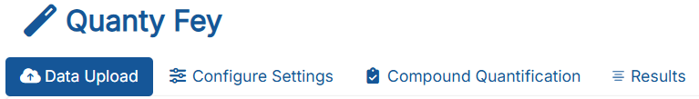
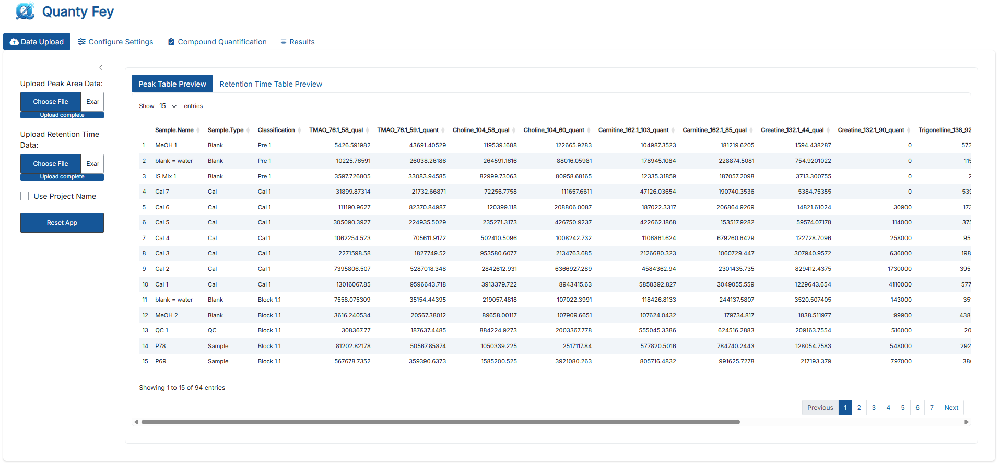
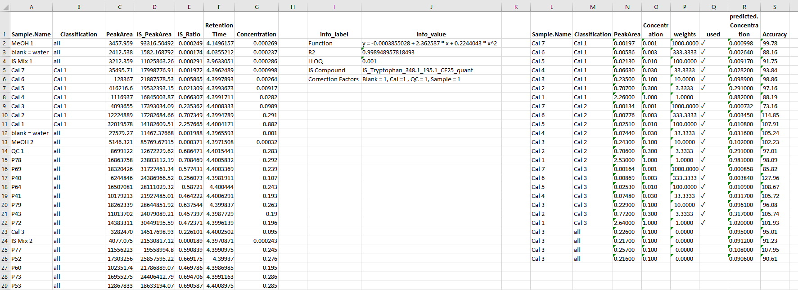

# **Tutorial**
This file will serve as a tutorial for the effective use of the **QuantyFey** application.

## **Installation**
The standalone version of this application runs on **Windows**, and **Linux**.
Running the app from your local R, RStuio, or VS Code works also for **Mac**.

### **Prerequisites**
- **Windows**
    - **RTools**: Version 4.2 must be installed.
        - **Option A**: Use the [official installer](https://cran.r-project.org/bin/windows/Rtools/rtools42/rtools.html).
        - **Option B**: From the included R Portable:
            - Run `R.exe` in the `R-portable/bin/` folder.
            - Execute the following commands:
            
              ```r
              install.packages("installr", repos = "https://cloud.r-project.org/")
              installr::install.Rtools()
              ```
          - Follow the installer instructions.
          - **Note:** An error may occur during finalization. Dismiss the error and proceed with the installation.

- **Linux**
    - **Install** all dependencies using the following code:
      ```{bash}
      sudo apt install -y cmake libcurl4-openssl-dev libssl-dev libfontconfig1-dev libfreetype6-dev libharfbuzz-dev libfribidi-dev libpng-dev libjpeg-dev libtiff5-dev default-jdk libtirpc-dev build-essential pkg-config

      sudo R CMD javareconf
      ```


### **Standalone Installation**
- **Windows**
    - **Download** the current version of [QuantyFey](QuantyFey-Application/releases)
    - **Unzip** the folder to a destination of your choosing.
    - **Run** the batch file to execute the App (**Note** approval of the batch file is required)
    - A console will open and first all dependencies will be installed automatically (this can take up to 20 minutes at first launch).

- **Linux**
    - **Download** the current version of [QuantyFey](QuantyFey-Application/releases)
    - **Unzip** the folder to a destination of your choosing.
    - **Run** the batch file to execute the App (**Note** approval of the batch file is required)
    - A console will open and first all dependencies will be installed automatically (this can take up to 20 minutes at first launch).

### **Installation for launching the app using RStudio, VS Code etc.**
- **Download** the GitHub repository.
- **Unzip** the files to a destination of your choosing.
- **Install** [RStudio](https://posit.co/download/rstudio-desktop/) or [VS Code](https://code.visualstudio.com/download)
- **Install** [pandoc](https://pandoc.org/installing.html)
- **Install** prerequisites
- **Open** the `app.R` file and **run** it's content.

**Note**: At launch there will pop up some error messages in the console - ignore them :)

### **Notes before using it on your own data**
The application comes with multiple test datasets. These represent published mass spectrometry (**add sources here**)
Please note that the setup is adjusted for these dataset. This setup includes the **Names** of **Calibration Standards** and their **Concentration**.
These must be adjusted for your own data **before** launching the app.
To adjust the setup go to `Dependencies/tempaltes.xlsx`.
There you can add a template for your own analysis.
The templates **must** follow the following structure:
- **Cal.Name:** The first column name must be Cal.Name (spelling is important) with the **Names** of the Calibration Standards within your Sequence.
- **Concentration:** The next column must have the **Concentration** of each of those Calibration Standards. Alternatively, each transition can be added to have different Concentrations for each Transition
    - **Note:** If Transitions are used, every single transition name **must** be present! For all quantifier **and** qualifier transition.


## **Application Structure**

The application is organized into several tabs, each serving a distinct purpose. These tabs include:



---

### **Data Upload**

This tab allows users to upload the required data files. Two files must be uploaded (**csv**, **txt**, or **xlsx** format with standard delimiters):



- **Peak Table**: Contains peak intensity data (**Peak Areas** or **Peak Heights**) for the compounds of interest. The table must adhere to the following format:
    - **Sample.Name**: Name of the sample.
    - **Sample.Type**: Type of sample, which can be:
        - **Sample**: The sample to be quantified.
        - **Standard** or **Cal**: Calibration standards for quantification.
        - **Blank**: Blank samples for background correction.
        - **QC**: Quality control samples.
        - **Note:** Correct spelling is required.
    - **Classification** (optional): Used to segment the sequence into distinct blocks for bracketing analysis. 
        - Calibration standards must follow the naming convention **Cal n**, where `n` is the calibration level (e.g., **Cal 1**, **Cal 2**).
        - Sample blocks can be named freely (e.g., **Sample Block 1**, **Sample Block 2**).
        - **Note**: Calibration levels must start with **Cal 1** and proceed sequentially.
        - **Note**: If this column is not present, it will be generated automatically. The algorithm searches for multiple Standards (>= 3) that were injected in a row and assumes this is a Calibration Curve. Then it will send everything To a sample block, and repeats it for the next calibration curve. Everything before the first calibration curve will be names `Pre 1`.

**Note**: After upload, error messages might pop up, if any of the required columns are missing, or the setup of these columns is wrong. Also, if there are no IS transitions found with the pattern, a pop up will happen, and it will tell you that you cannot use internal standard correction in this setup and all parameters for IS correction will not be shown in the user interface.

Example datasets are provided in the folder `Example_Datasets/Example1_Drift_Areas.csv`.


**Schematic Examples**:

Table: Example Dataset for Peak Table

| Sample.Name  | Sample.Type | Classification | Compound1_quant | Compound1_qual |
|:------------:|:-----------:|:--------------:|:---------------:|:--------------:|
|    Blank     |    Blank    |     Pre 1      |      0.00       |     0.0000     |
|    Blank     |    Blank    |     Pre 1      |      0.00       |     0.0000     |
|      QC      |     QC      |     Pre 1      |     3443.00     |   1146.9333    |
|      QC      |     QC      |     Pre 1      |     2973.50     |    990.5333    |
|      QC      |     QC      |     Pre 1      |     3130.00     |   1042.6667    |
|    Blank     |    Blank    |     Pre 1      |      0.00       |     0.0000     |
|  Cal 1 ppm   |  Standard   |     Cal 1      |     1878.00     |    625.6000    |
|  Cal 3 ppm   |  Standard   |     Cal 1      |     5321.00     |   1772.5333    |
|  Cal 10 ppm  |  Standard   |     Cal 1      |    16432.50     |   5474.0000    |
|    Blank     |    Blank    |    Block 1     |      0.00       |     0.0000     |
|    Blank     |    Blank    |    Block 1     |      0.00       |     0.0000     |
|      QC      |     QC      |    Block 1     |     3114.35     |   1037.4533    |
|   Sample 1   |   Sample    |    Block 1     |     2347.50     |    782.0000    |
|   Sample 2   |   Sample    |    Block 1     |     3912.50     |   1303.3333    |
|   Sample 3   |   Sample    |    Block 1     |     5477.50     |   1824.6667    |
|      QC      |     QC      |    Block 1     |     2957.85     |    985.3200    |
|    Blank     |    Blank    |    Block 1     |      0.00       |     0.0000     |
|  Cal 1 ppm   |  Standard   |     Cal 2      |     1878.00     |    625.6000    |
|  Cal 3 ppm   |  Standard   |     Cal 2      |     5321.00     |   1772.5333    |
|  Cal 10 ppm  |  Standard   |     Cal 2      |    16432.50     |   5474.0000    |


- **Retention Time Table**: Contains the Retention Time (RT) data for the compounds of interest. 
    - Must include a **Sample.Name** column with values identical to those in the Peak Table.
    - Only transitions present in the Peak Table will be considered for analysis.
    - Upload the RT Table only after uploading the Peak Table.

Refer to the example dataset `Example_Datasets/Example1_Drift_RT.csv` for the required format.


**Schematic Examples**:
Table: Example Dataset for Retention Time Table

| Sample.Name  | Compound1_quan | Compound1_qual |
|:------------:|:--------------:|:--------------:|
|    Blank     |       NA       |       NA       |
|    Blank     |       NA       |       NA       |
|      QC      |    1.496478    |    1.500440    |
|      QC      |    1.501113    |    1.500998    |
|      QC      |    1.494299    |    1.492327    |
|    Blank     |       NA       |       NA       |
|  Cal 1 ppm   |    1.498587    |    1.499848    |
|  Cal 3 ppm   |    1.499643    |    1.497129    |
|  Cal 10 ppm  |    1.497941    |    1.494750    |
|    Blank     |       NA       |       NA       |
|    Blank     |       NA       |       NA       |
|      QC      |    1.496535    |    1.504295    |
|   Sample 1   |    1.498326    |    1.505902    |
|   Sample 2   |    1.505464    |    1.497545    |
|   Sample 3   |    1.501861    |    1.492793    |
|      QC      |    1.497873    |    1.502696    |
|    Blank     |       NA       |       NA       |
|  Cal 1 ppm   |    1.496491    |    1.500002    |
|  Cal 3 ppm   |    1.501985    |    1.507087    |
|  Cal 10 ppm  |    1.497683    |    1.496272    |

**Note**: Additional columns are acceptable but will not be processed by the application.

- **Project Name**
    - The app will generate output during the analysis, this **Project Name** will be used as the folder name where the output will be generated into.
    - The app will try to save all output in the users **Documents** folder and will generate a folder called **QuantyFey** the porject name folder will be found within this folder.


- **Reset the application**
    - The application can be reset here if needed. This could be due to a wrong datafile being uploaded.

### **Configure Settings**

The **Configure Settings** tab allows users to define parameters for the quantification analysis. These parameters include:


- **Template**:
    - Select the template for the 
    - Each **sheet** represents an available template for the app.
    - Two example templates are provided by default.
    - Two styles are supported:
        - **Uniform concentration for all standards**: Requires two columns:
            - **Cal.Name**: Names of the calibration standards.
            - **Concentration**: Concentration values of the calibration standards.
        - **Variable concentrations for each standard**: Requires one column for **Cal.Name** and columns for **each transition** in the Peak Table:
            - **Cal.Name**: Names of the calibration standards.
            - **Additional columns**: Concentration values for each transition.
            - **Note**: All transitions in the Peak Table **must** be present in the template.
        - **Note:** Standards with a concentration of **0** will be excluded from the calibration function.
    - Ensure the template is configured before launching the app, as the **Templates.xlsx** file is read only at startup.
    - Verify spelling consistency to avoid errors.

#### **Change Patterns**
The app attempts to find quantifier, qualifier and internal standard transition by searching for patterns in the column names of the Peak Table. These patterns can be adjusted.
**Note:** The default patterns can be changed in the `defaults_settings.R`file by renaming the respective variable.

```{r}
## Setup Default Settings for QuantyFey

# Default Template name
Template_name = "Example1" 
# Pattern for Quant Transition:
quant_pattern = "_quant"
# Pattern for Qual Transition:
qual_pattern = "_qual"
# Pattern for IS Transition:
IS_pattern = "IS"

```
The default values can easily be changed by changing e.g., `Template_name = "Example1"` to `Template_name = "Example2"`.
**Note:** All of these values can be changed also within the app, but this might optimize utilization of the app by adjusting it to the users data.

- **Pattern for Quant Transition**: Defines the pattern to identify quantifier transitions in the Peak Table column names.
    - Supports regular expressions.
    - Examples:
        - `^Compound1_`: Matches column names starting with "Compound1_".
        - `_quant$`: Matches column names ending with "_quant".
        - `Compound[0-9]+_`: Matches column names containing "Compound" followed by digits and an underscore.
        - `.*_qual`: Matches column names containing "_qual".
        - `^Cal.*ppb$`: Matches column names starting with "Cal" and ending with "ppb".
    - **Note**: Use `\.` to match a literal dot (e.g., `\.quant` for "Compound1.quant").
    - Only matched columns will be available for quantification.

- **Pattern for Qual Transition**: Defines the pattern to identify qualifier transitions in the Peak Table column names.
    - Supports regular expressions.
    - Qualifier transitions are matched to quantifier transitions based on their **prefix**.
        - **Prefix** is considered the first position before the first **underscore** ("_").
        - Therefore, transitions should have the following structure: **CompoundID**\_*additional*\_*information*\_**qual/quant/IS pattern**.
        - *Additional information* could be Q1 and Q3 mass, collision energy, etc.


- **Pattern for IS Transitions**: Defines the pattern to identify internal standard transitions in the Peak Table column names.
    - Supports regular expressions.
    - If no matches are found, internal standard correction will be unavailable (a message will be displayed).
    - Columns matching this pattern will not be used for quantification.


---

### **Compound Quantification**

The **Compound Quantification** tab is the primary interface for **drift correction**, **model optimization**, and **quantification**. 

#### **Setup**


On the left panel, users can configure the following:
- **Compound**: Select the quantification transition.
- **Internal Standard**: Choose the internal standard transition for correction. (This will only be shown if IS transitions were found in the data).
- **Comment**: Add notes for the quantification process.
- **Save**: Save the quantification results for the selected transition.

#### **Main Tabs**

The main panel contains five tabs:


Each tab will be explained in more detail in the following section.

---

#### **Data Visualization**


This tab provides an overview of the data for the selected transitions, including **Retention Time (RT)**, **Qual/Quant Analysis**, and **Blank Analysis**.

- **Retention Time**: Interactive plot of RT values for selected sample types. Hovering over points displays sample details.
- **Qual/Quant Analysis**: Interactive plot of Qual/Quant ratios for selected sample types. Hovering over points displays sample details.
- **Blank Analysis**: Boxplots comparing blank and sample signal ratios, aiding in assessing background signal interference.

---

#### **Drift Correction**

This tab applies statistical drift correction to the selected transition.


- **Models**: 
    - **Linear Model (lm)**: Simple linear regression.
    - **Loess**: Non-linear locally estimated scatterplot smoothing.
- **Sample for Drift Correction**: Select a sample (e.g., QC) injected regularly throughout the sequence.
    - **Note**: Loess models cannot extrapolate; edge corrections use the nearest available factor.
- **Span Width**: Adjustable for loess models. (Will only be shown if loess was used for the drift model).

The main panel displays:

- **Raw Intensity Plot**: Intensity values before correction.
- **Corrected Intensity Plot**: Intensity values after drift correction.

---

#### **IS Correction**

This tab performs internal standard (IS) correction for the selected transition.


- **Correction Factors**: Adjustable for sample types with varying IS concentrations.
- **Plots**:
    - **Raw Intensity**: Light blue bars represent raw intensities; red dots indicate IS intensities.
    - **Corrected Ratios**: Displays IS-corrected intensity ratios.

**Note**: IS values below 0.1% of the median are treated as absent and set to 0.

---

#### **Bracketing**

This tab configures the bracketing analysis.

##### **Bracketing Table**:
This table displays all **unique blocks** from the **Classification** column in the **Peak Table**.
The columns represent the **Calibration Blocks** from the **Classification** column.
By toggling the checkmarks, each **Block** can be assigned to its corresponding **Calibration Block** for quantification.


**Note**: Each class must include at least one calibration block for bracketing to function.

### **Quantitation**

This tab facilitates the quantification of the selected transition. Key parameters and settings can be adjusted on the left panel.

#### **Parameters**


- **Degree**: Degree of the calibration function (1 = linear, 2 = quadratic).
- **Block to Visualize**: Specifies the block for visualization during bracketing. Ignored for other quantitation methods.
- **Limit of Quantification (LLOQ)**: Defines the lower quantification limit. Defaults to the smallest calibration standard value but can be adjusted.
- **Weighting Method**: Specifies the regression weighting:
    - **1/x**: Weight = 1 / Concentration.
    - **1/x2**: Weight = 1 / Concentration².
    - **None**: No weighting applied.
- **Quantitation Method**: Selects the quantification approach:
    - **IS Correction**: Internal standard correction.
    - **Drift Correction**: Statistical drift correction.
    - **Bracketing**: Bracketing-based quantification.
    - **Default**: Calibration function only.
- **Show Samples**: Toggles sample visibility in plots.
- **Apply Cal Levels to All**: Applies calibration levels across all blocks (for bracketing).
    - **Note**: if one calibration standard was removed, clicking will remove all standards of this level from the model.
- **Apply LLOQ to All**: Applies the LLOQ across all samples (for bracketing).
- **Optimize Model**: Automates model optimization:
    - Removes higher standards for quadratic models if samples are lower.
    - Removes lower standards if accuracy falls outside 70–130% and samples are higher.
    - Selects linear or quadratic models based on a lack-of-fit test.


#### **Interactive Features**
- **Exclude Standards**: Left-click on a standard to exclude it from the calibration. Click again to restore.

#### **Main Tabs**
1. **Plots**: Displays the regression plot. Standards can be excluded or restored interactively.


2. **Accuracy**: Summarizes regression model accuracy.


3. **Model Diagnostics**: Provides diagnostic plots (via `lindia` package):
    - Histogram of Residuals
    - Residuals vs. Fitted Values
    - Normal Q-Q Plot
    - Scale-Location Plot
    - Residuals vs. Leverage
    - Cook's Distance
  


4. **Results**: Displays quantification results for the selected transition.


#### **Saving Results**

Once the quantitation method is selected, and the model is optimized, results can be saved:
- **Comment**: Add notes for the compound.
- **Save**: Saves the data and generates:
    - **results_quant_interim.csv**: Contains concentrations for all quantified compounds. Values below LLOQ are labeled as "< LLOQ".
    - **quant_results.xlsx**: Summarizes parameters and results for each compound in separate sheets.
    - **Generate Report** (optional): Creates a PDF report with relevant plots and details.

**Notes**:
- To prevent overwriting, files are timestamped if duplicates exist.
- Reports can be overwritten; rename or move them to avoid conflicts.
- All files are saved in the "QuantyFey" folder in the user's Documents directory. Ensure all files are consolidated for multi-session projects.

This tab becomes functional after at least one compound has been quantified and saved. It provides a summary of all compounds quantified during the current session. The displayed table corresponds to the **results_quant_interim.csv** file.

### **Results**
 

#### **Data generation**

After using **save** the app will automatically generate output in the users **Documents** folder. A **QuantyFey** folder with a subfolder **Results_*date*** will be generated.
In this folder the following files will be generated:
- results_quant.xlsx
- Results_evaluation_interim.csv
- Report_*QuantTransition*.pdf (**optional**)


##### **results_quant.xlsx**

This excel file contains all information necessary for the repetition of the exact concentrations calculated for the quantified compounds. For each saved transition, a new sheet is apended.



#### **Results_evaluation_interim.csv**

This csv file contains the concentrations of all quantified compounds in the current session. It is frequently apended after every save, and is represented by the results tab.


#### **Report**

The **report** can be generated by ticking the **generate report** before saving the quantitation results. This will generate a pdf report with all plots, and information about the quantification.


#### **Summary**

After configuring the settings, the application facilitates a comprehensive evaluation of data quality. Retention Time (RT) and Qual/Quant ratios can be reviewed to confirm correct compound identification. Blank analysis aids in determining whether sample signals are free from background interference.

Drift correction can be applied using statistical drift correction, internal standard correction, or bracketing. These methods must be configured prior to quantification.

The app provides an interactive interface for regression model optimization, allowing users to adjust parameters and evaluate models. An automated optimization process is available to suggest suitable models based on the data. Users can manually refine models to achieve satisfactory results. 

Results are saved only after successful optimization. Safeguards are implemented to prevent file overwriting; however, users are advised to verify generated files and reports.


### **Troubleshooting**

- **Package Installation Failure**:
    - Ensure RTools 4.2 is correctly installed.
    - Note: The application is compatible only with Windows systems.

- **Console Does Not Open**:
    - Relocate the application folder to a different directory.
    - Avoid running the application from the "Downloads" folder, as this may cause issues.

patchwork version 1.3.0
cowplot version 1.1.3
