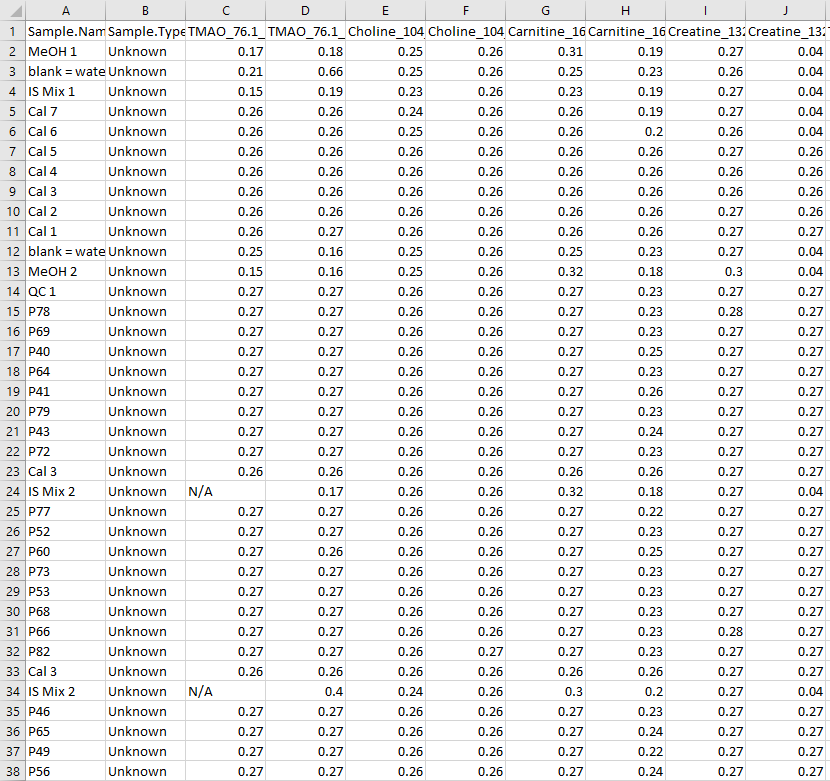
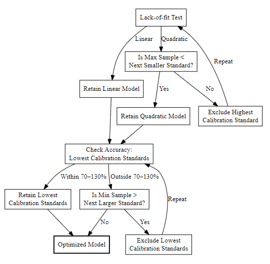

## Tutorial
This tutorials explains how to use the **QuantyFey** application, step by step. It covers everything you need to get started and use it efficiently. QuantyFey is designed to quantify targeted LC-MS/MS data using external calibration, but can also be used with other data formats that include intensity and retention time values.

### Installation
The standalone version of this application runs on **Windows** and **Linux**. You can also run it directly from **R**, **RStudio**, or **VS Code**, which makes it compatible with **macOS** as well.

#### Prerequisites

##### Windows
- **RTools 4.2** is required:
  - **Option A**: Install from the [official CRAN page](https://cran.r-project.org/bin/windows/Rtools/rtools.html).
  - **Option B**: Use the included Portable R:
    - Navigate to `R-portable/bin/` and launch `R.exe`
    - Run the following in the R console:
      ```r
      install.packages("installr", repos = "https://cloud.r-project.org/")
      installr::install.Rtools()
      ```
    - Do not update the R version if prompted.
    - Follow the installer instructions. You can ignore any non-critical error during the final steps.

##### Linux
Make sure all system dependencies are installed:
```bash
sudo apt install -y cmake libcurl4-openssl-dev libssl-dev libfontconfig1-dev libfreetype6-dev \
libharfbuzz-dev libfribidi-dev libpng-dev libjpeg-dev libtiff5-dev default-jdk libtirpc-dev \
build-essential pkg-config

sudo R CMD javareconf
```

#### **Standalone Installation**

- **Download** the latest version of [QuantyFey](https://github.com/QuantyFey-Application/releases)
- **Unzip** the folder to a destination of your choice.
- **Run** the batch (Windows) or shell (Linux) file to start the App
    *Note: you may need to approve the execution of the script on Windows*
- A console will open and first all requirec packages will be installed automatically


#### **Installation for launching the app using RStudio, VS Code etc.**
- **Download** the GitHub repository.
- **Unzip** the files to a destination of your choosing.
- **Install** [RStudio](https://posit.co/download/rstudio-desktop/) or [VS Code](https://code.visualstudio.com/download)
- **Install** [pandoc](https://pandoc.org/installing.html)
- **Install** prerequisites as mentioned above.
- **Open** `app.R` and **run** run the script


> *Note: On first launch, the app uses the `renv` package to restore the required R package environment. This enusres compatibility by installing the correct package versions. This process may take up to 20 minutes.*

---

#### **Notes before using it on your own data**

The application comes with several test datasets based on LC-MS/MS data. These are included to help you get started and explore the app's features.

> **!! Important:** The app is preconfigured to work with these test datasets. This includes predefined **Calibration Standard Names** and their **Concentrations**. Before using your own data, you'll need to update this setup.

To adjust the configuration:
1. open the file at `Dependencies/templates.xlsx`
2. Add a new sheet or edit an existig one to define your own analysis setup.

**Template Structure Requirements**
The template must follow this structure exactly:
- `Cal.Name`: The first column must be named `Cal.Name` (spelling and case-sensitive). It should list the **names of the Calibration Standards** used in your sequence.
- `Concentration`: The second column should specify the **concentration** for each corresponding **Calibration Standard**.
You may also define concentrations at the **transition level** (e.g., different concentrations for every single transition). In that case:
- Every individual **transition name must be included in the template**.

The app uses this file to **map the concentrations** of the Calibration standards to their corresponding names in the dataset. The concentrations are used for compound quantification.

> *Note: Standard names in the template must exactly match those in the sequence (case-sensitive).*
> *Note: if any standard that is defined in your data (Sample.Type column) is not included in this template, it will be appended with a concentration of 0 - but will not be included in the quantification process.*


## **Application Structure**

The app is divided into multiple tabs, each with a specific function. This layout helps guide users through the analysis process step by step.


---
### **Data Upload**

The **Data Upload** tab lets you import the two required data files for analysis. Two files must be uploaded in **CSV**, **TXT**, or **XLSX** format using standard delimiters (`,`, `;`, `:`, or tab `\t`):


#### **1. Peak Table**

This file contains **peak intensity data** (e.g., *Peak Areas* or *Peak Heights*) for the compounds of interest. The required structure is as follows:

- `Sample.Name`: Identifier for each sample.
- `Sample.Type`: Must be one of the following (case-sensitive):
  - `Sample` – Experimental samples.
  - `Standard` or `Cal` – Calibration standards.
  - `Blank` – Blank samples for background correction.
  - `QC` – Quality control samples.
- `Classification` *(optional)*: Defines distinct sequence blocks for **custom bracketing analysis**.
  - Calibration standards must follow the pattern `Cal n` (e.g., `Cal 1`, `Cal 2`, ...).
  - Sample blocks may be named freely (e.g., `Sample Block 1`, `Block A`).
  - **Note**: If this column is missing, it will be auto-generated:
    - Calibration curves are identified as three or more consecutive standards.
    - Sample blocks are defined between these curves.
    - Samples before the first calibration are labeled `Pre 1`.

> **!! Important**
> - Missing or incorrectly formatted columns will lead to an error massege and upload will be halted.
> - If internal standards are not recognized by the default pattern, a warning message will appear and internal standard correction features will be disabled.
>   By updating the internal standard pattern these features can be restored.

##### Example Table: Peak Table Format

Example file: `Example_Datasets/Example1_Drift_Areas.csv`


#### **2. Retention Time Table**

This file provides **retention time (RT)** data for the compounds.

- Must include a `Sample.Name` column identical to that in the Peak Table.
- Only compounds present in the Peak Table will be considered.
- Upload the RT Table **after** the Peak Table.
> *Note: the app will ignore any additional columns that aren't needed.

##### Example Table: Retention Time Table Format

Example file: `Example_Datasets/Example1_Drift_RT.csv`



> **Note:** Additional columns are allowed but will be ignored by the application.

#### **3. Project Name (optional)**

You may optionally enter a **Project Name**, which will be used to label output folders.

- Output will be saved in the user's **Documents** folder under:  
  `Documents/QuantyFey/<ProjectName>/`

#### **4. Reset the Application**

Click **Reset App** to restart the session and clear all uploaded data — useful if the wrong files were selected or you want to begin a new analysis.

#### Summary: Minimum Upload Requirements

| File                | Required Columns                        | Notes                                                       |
|---------------------|------------------------------------------|-------------------------------------------------------------|
| **Peak Table**      | `Sample.Name`, `Sample.Type`             | Optional: `Classification`; supports multiple transitions.  |
| **RT Table**        | `Sample.Name`, transitions from Peak Table | Must match Peak Table sample names.                         |

---

### **Configure Settings:**

#### **Selecting Quantification Template**
To perform quantification, you need to select the appropriate template. Use the dropdown menu in the app to chosse from available sheets in teh `templates.xlsx`file. Each sheet represents a separate template.
When selected, the left pane will be updated with the respective template. If the template encompasses all transition names, it will show the concentrations of the selected compound.

 > *Make sure the correct template is selected - quantification will not work if the template does not match your data or the wrong sheet is chosen.


#### **Change patterns**
QuantyFey automatically detects **Quantifier**, **Qualifier**, and **Internal Standard (IS)** transitions by searching for predefined patterns in the column names of the Peak Table. These patterns can be customized to match your dataset's naming.
Patterns can be changed by selecting the `Change Patterns` Checkbox. Then three inputs will be shown, that can be adjusted.

> **Tip:** You can set default values by modifying the `default_settings.R` file, or override them directly within the app interface.

---

#### **Default Pattern Setup (in `default_settings.R`)**

Below are the default settings used by the app. You can change them in the `default_settings.R` file.

| Setting         | Default Value | Description                                                |
| --------------- | ------------- | ---------------------------------------------------------- |
| `quant_pattern` | `_quant`      | Identifies quantifier transition columns                   |
| `qual_pattern`  | `_qual`       | Identifies qualifier transition columns                    |
| `IS_pattern`    | `IS`          | Identifies internal standard transition columns            |
| `conc_unit`\*   | `µg/mL`       | Unit used for concentration in plots and tables            |
| `int_unit`\*    | `counts`      | Unit used for intensity values in outputs                  |
| `rt_unit`\*     | `min`         | Unit used for retention time                               |
| `Template_name` | `Example1`    | Default name of the template used for quantification setup |

> \* These unit values can only be adjusted in the default_settings.R file and are not editable from within the app interface.


##### Code (as seen in `default_settings.R`)

```r
## Setup Default Settings for QuantyFey

# Default Template name
Template_name = "Example1" 
# Pattern for Quant Transition:
quant_pattern = "_quant"
# Pattern for Qual Transition:
qual_pattern = "_qual"
# Pattern for IS Transition:
IS_pattern = "IS"

#### ---- Units ---- ####
# Set to NULL if you don't want to show the unit in the plot
# Concentration 
conc_unit = "µg/mL"
# Intensity Unit
int_unit = "counts"
# RT Unit
rt_unit = "min"
```

> *Note: Updating the units helps ensure consistency between your dataset and the visualization/output displays in the app.*

---

### **Pattern for Quantifier Transitions**

This pattern identifies **quantifier** transitions from Peak Table column names.

- Supports **regular expressions** (*Regex*)
- Only columns matching this pattern (and **not** matching the IS pattern) will be used for quantification.

#### Examples:
- `^Compound1_` → Columns starting with `Compound1_`
- `_quant$` → Columns ending with `_quant`
- `Compound[0-9]+_` → Matches names like `Compound1_`, `Compound2_`, etc.
- `.*_qual` → Columns containing `_qual`
- `^Cal.*ppb$` → Columns starting with `Cal` and ending with `ppb`


> **!! Important: Understanding Regular Expressions**
> - `.` matches any single character.
> - `*` means zero or more of the previous character.
> - `^` anchors the match to the start of the text.
> - `$` anchors the match to the end of the text.
> - `.*` matches any number of any character.
> - To match a literal `.` or `*`, escape it with a backlash: `\.` or `\*`.
> - For more information check out this (Regex Quick Reference)[https://hypebright.nl/en/r-en/ultimate-cheatsheet-for-regex-in-r-2/]


### **Pattern for Qualifier Transitions**

Defines how **qualifier** transitions are detected.

- Also uses **regular expressions**
- Matches are determined based on the **prefix** of the corresponding quantifier transition.

#### Prefix Matching Logic:
- The **prefix** is the string before the first underscore (`_`)
- Example formats:
  - `CompoundID_Q1_Q3_CE_quant`
  - `CompoundID.Q1_Q3_CE_qual`

> If no matching qualifier transitions are found, the **Qualifier/Quantifier Ratio Analysis** tab will be hidden.

### **Pattern for IS Transitions**

This pattern identifies **internal standard** transitions.

- Supports **regular expressions**
- Matching columns will:
  - be **excluded** from quantification
  - be **used** for IS correction (if enabled)

> If no IS transitions are detected, IS correction will be disabled automatically and a warning message will appear.


---

### **Compound Quantification**
The **Compound Quantification** tab is the main workspace for **visualization**, **drift correction**, **regression model optimization**, and **quantification**. 

#### **Setup**


In the left-side panel, users can configure the following:
- **Compound**: Select the quantification transition.
- **Comment**: Add notes for the quantification process.
- **Save**:
    - Ouput is saved to users **Documents** folder
    - If the default path fails (e.g., due to permissions), results are saved to the local QuantyFey directory.
    - Files are placed inside a folder names `Results_<date>` unless a different name is specified in the **Data Upload** tab.
    - Two output files are created and updated with each save:
    -   A **concentration table** (`Results_quant.csv`) per compound.
    -   A **summary file**  (`Quant_summary.xlsx`) listing all parameters and settings, with one sheet per save.

- **Generate Report**: Optional checkbox. If enabled, a PDF report will be created containing all plots and a summary of the quantification.

> Not on File Management:
> To avoid overfitting while limiting file clutter:
> - Concentration tables: The app checks for differences between the existing file and the new data. If all data from the existing file matches data from the new data, the file is overwritten. If differences exist, a new file is created with a time stamp.
> - Summary File: With every save, data is appended to the file.
> - PDF Report: Reports may be overwritten if the app is restarted and outputs are saved to the same directory.
> Suggestion: After launching the app, create a new output folder by renaming the project name in the **Data Upload** tab. This helps prevent conflicts and ensures all outputs are saved cleanly.


#### **Main Tabs**

The main panel contains five tabs:


Each tab will be explained in  detail in the following section.

---

#### **Data Visualization**


This tab provides an overview of the data for the selected transitions, including **Retention Time (RT)**, **Ion Ratio Analysis**, and **Blank Analysis**.

- **Retention Time**: Interactive plot of RT values for selected sample types. Hover over any point to view sample-specific details.
- **Ion Ratio Analysis**: Interactive plot of Qualifier-to-Quantifier Ion ratios for selected sample types. Hover over any point to view sample-specific details.
  > Note: This section is only visible if a matching Qulaifier was found for the selected Quantifier transition.
- **Blank Analysis**: Boxplots comparing blank and sample signal ratios.
  Blank ratios are calculated as: `sample intensity / mean blank intensity`
  This helps distinguish background noise from true signals.

This visualization tab is designed to help **verify compound identity** by comparing **RT**, and **Ion Ratios** between Samples and Standards and to compare signal intensities from Samples to Blanks to assess **carry over** and **background signals**.

---

### **Correcting for Intensity Drift**

The following four tabs are for the setup of the three drift handling strategies. For optimal usage, it is advised to setup all methods before quantifying the transitions. IS Correction will only show meaningful plots if IS transitions were found in the data. If not, this tab will be hidden.

#### **IS Correction**

This tab performs internal standard (IS) correction for the selected transition.


- **Correction Factors**: Adjustable for sample types with varying IS concentrations.
- **Plots**:
    - **Raw Intensity**: Light blue bars represent raw intensities; red dots indicate IS intensities.
    - **Corrected Ratios**: Displays IS-corrected intensity ratios.

**Note**: IS values below 0.1% of the median are treated as absent and set to 0.

---

#### **Drift Correction**

This tab applies statistical drift correction to the selected transition.


- **Models**: 
    - **Linear Model (lm)**: Simple linear regression.
    - **Loess**: Non-linear locally estimated scatterplot smoothing.
    - **Spline**: non-linear spline based regression.
- **Sample for Drift Correction**: Select a sample (e.g., QC) injected regularly throughout the sequence.
    - Only samples that were injected more than 3 times over the whole sequence will be shown, and samples indicated as blanks will be removed from the options.
    - **Note**: Loess models cannot extrapolate; edge corrections use the nearest available factor.
- **Span Width**: Adjustable for loess models. (Will only be shown if loess was used for the drift model).
- **Degree**: Degree of splines for spline regression (Will only be shown if splie is used for drift model).

The main panel displays:

- **Raw Intensity Plot**: Intensity values before correction.
- **Corrected Intensity Plot**: Intensity values after drift correction.

This tab works interacitvely in seeing how the model changes the actual intensity values. 
**Note** span width needs to be higher than 0.4: however, going smaller can lead to problems in the model generation. If an error message appears here, try to update the model before using it, to ensure no flawed models were used for drift correction!
**Note** The span width will only be updated after clicking outside of the input box!

---

#### **Custom Bracketing**

This tab configures the custom bracketing analysis.

##### **Bracketing Table**:
This table displays all **unique blocks** from the **Classification** column in the **Peak Table**.
The columns represent the **Calibration Blocks** from the **Classification** column.
By toggling the checkmarks, each **Block** can be assigned to its corresponding **Calibration Block** for quantification.


**Note**: Each class must include at least one calibration block for bracketing to function.

---

#### **Weighted Bracketing**

This tab configures the weighted backeting analyis.

Settings:
Model: 
- linear:
- non-linear: using QC-samples or other technical replicates
  - loess
  - spline
    
### **Quantitation**

This tab facilitates the quantification of the selected transition. Key parameters and settings can be adjusted on the left panel.

#### **Parameters**


- **Regression Model**: Currently linear and quadratic models are implemented.
- **Limit of Quantification (LLOQ)**: Defines the lower quantification limit. Defaults to the smallest calibration standard value but can be adjusted. This setting will not interact with the plot, however it is used to define the threshold by where concentrations should still be reported in the output. 
- **Weighting Method**: Specifies the regression weighting:
    - **1/x**: Weight = 1 / Concentration.
    - **1/x2**: Weight = 1 / Concentration².
    - **1/y**: Weight = 1 / PeakArea
    - **1/y2**: Weight = 1 / PeakArea²
    - **1/x force 0**: Weight = 1 / Concentration and goes through 0|0
    - **1/y force 0**: Weight = 1 / PeakArea and goes through 0|0
    - **None**: No weighting applied.
    - **Note**: Values with PeakArea = 0 will automatically hava a weight of 0 and will not be included in the regression.
- **Quantitation Method**: Selects the quantification approach:
    - **IS Correction**: Internal standard correction.
    - **Drift Correction**: Statistical drift correction.
    - **Bracketing**: Bracketing-based quantification.
    - **Default**: Calibration function only.
- **Show Samples**: Toggles sample visibility in plots.

If **Bracketing** is used for quantification the following settings will appear:
- **Block to Visualize**: Specifies the block for visualization during bracketing. Ignored for other quantitation methods.
- **Apply Cal Levels to All**: Applies calibration levels across all blocks (for bracketing).
    - **Note**: if one calibration standard was removed, clicking will remove all standards of this level from the model.
- **Apply LLOQ to All**: Applies the LLOQ across all samples (for bracketing).

An automatic optimization Button allows the user to do a generic optimization of the regression model. 
- **Optimize Model**: Automates model optimization:
    - Removes higher standards for quadratic models if samples are lower.
    - Removes lower standards if accuracy falls outside 70–130% and samples are higher.
    - Selects linear or quadratic models based on a lack-of-fit test.
**Note** that this is not valid for every single transition, and can also fail if the data has poor quality!



#### **Interactive Features**
- **Exclude Standards**: Left-click on a standard to exclude it from the calibration. Click again to restore.
- **Toggle Standards**: By using one of the select tools in the upper corner, multiple standards can be removed/added to the model by selecting them and approving the message.

#### **Main Tabs**
1. **Plots**: Displays the regression plot. Standards can be excluded or restored interactively.


2. **Accuracy**: Summarizes regression model accuracy.
The user can remove also here standards from the model by clicking on or selecting the respective dot(s) in the plot.


3. **Model Diagnostics**: Provides diagnostic plots (via `lindia` package):
    - Histogram of Residuals
    - Residuals vs. Fitted Values
    - Normal Q-Q Plot
    - Scale-Location Plot
    - Residuals vs. Leverage
    - Cook's Distance
**Note**: For more information please look at the documentation/vignette fo the lindia package.
  


4. **Results**: Displays quantification results for the selected transition.


#### **Saving Results**

Once the quantitation method is selected, and the model is optimized, results can be saved:
- **Comment**: Add notes for the compound.
- **Save**: Saves the data and generates:
    - **results_quant_interim.csv**: Contains concentrations for all quantified compounds. Values below LLOQ are labeled as "< LLOQ".
    - **quant_results.xlsx**: Summarizes parameters and results for each compound in separate sheets.
    - **Generate Report** (optional): Creates a PDF report with relevant plots and details.

**Notes**:
- To prevent overwriting, files are timestamped if duplicates exist.
- Reports can be overwritten; rename or move them to avoid conflicts.
- All files are saved in the "QuantyFey" folder in the user's Documents directory. Ensure all files are consolidated for multi-session projects.

#### **Data generation**

After using **save** the app will automatically generate output in the users **Documents** folder. A **QuantyFey** folder with a subfolder **Results_*date*** will be generated.
In this folder the following files will be generated:
- results_quant.xlsx
- Results_evaluation_interim.csv
- Report_*QuantTransition*.pdf (**optional**)


##### **results_quant.xlsx**

This excel file contains all information necessary for the repetition of the exact concentrations calculated for the quantified compounds. For each saved transition, a new sheet is apended.


#### **Results_evaluation_interim.csv**

This csv file contains the concentrations of all quantified compounds in the current session. It is frequently apended after every save, and is represented by the results tab.


#### **Report**

The **report** can be generated by ticking the **generate report** before saving the quantitation results. This will generate a pdf report with all plots, and information about the quantification.


### **Results**
This tab becomes functional after at least one compound has been quantified and saved. It provides a summary of all compounds quantified during the current session. The displayed table corresponds to the **results_quant_interim.csv** file.
**Note** this tab can be manually overwritten. E.g., a comment needs to be adjusted or changed. This will however not automaticially change the generated output. And as the content of the results changes -> a new file will be saved with a timestamp. Also the report will not have the new comment, and also the resaults_quant will not have the overwritten comment. Usually it makes more sense, to save the compound with the same settings but with the new comment, to also have all the generated output up-to-date. When saving one compound multiple times, it will get a prefix **re_n** were n is the number how often the compound was re-saved. This will show up in the report file name, the sheet name of quant_results.xlsx, and a new column in the Results_evaluation_interim.csv file. Make sure that the comment lets you know which one of those you want to actually use if you re-saved a compound multiple times! (Nothing will be overwritten, so all versions of the save will be available, but that can lead to confusion, so try to work carefully).

 


#### **Summary**

After configuring the settings, the application facilitates a comprehensive evaluation of data quality. Retention Time (RT) and Qual/Quant ratios can be reviewed to confirm correct compound identification. Blank analysis aids in determining whether sample signals are free from background interference.

Drift correction can be applied using statistical drift correction, internal standard correction, or bracketing. These methods must be configured prior to quantification.

The app provides an interactive interface for regression model optimization, allowing users to adjust parameters and evaluate models. An automated optimization process is available to suggest suitable models based on the data. Users can manually refine models to achieve satisfactory results. 

Results are saved only after successful optimization. Safeguards are implemented to prevent file overwriting; however, users are advised to verify generated files and reports.


### **Troubleshooting**

- **Package Installation Failure**:
    - Ensure RTools 4.2 is correctly installed.
    - Note: The application is compatible only with Windows systems.

- **Console Does Not Open**:
    - Relocate the application folder to a different directory.
    - Avoid running the application from the "Downloads" folder, as this may cause issues.

