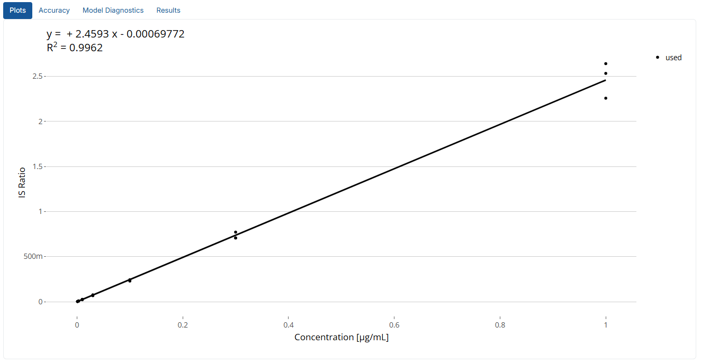

## Tutorial
This tutorial provides detailed guidance for effectively using the **QuantyFey** application.

### Installation
The standalone version of this applications runs on **Windows** and **Linux**. It can also be run from within **R**, **RStudio**, or **VS Code**, which allows compatibility with **macOS**.

#### Prerequisites

##### Windows
- **RTools 4.2** is required:
  - **Option A**: Install from the [official CRAN page](https://cran.r-project.org/bin/windows/Rtools/rtools.html).
  - **Option B**: Use the included Portable R:
    - Navigate to `R-portable/bin/` and launch `R.exe`
    - Run the following in the R console:
      ```r
      install.packages("installr", repos = "https://cloud.r-project.org/")
      installr::install.Rtools()
      ```
    - Follow the installer steps. You may ignore any non-critical error during finalization.

##### Linux
Ensure all system dependencies are installed:
```bash
sudo apt install -y cmake libcurl4-openssl-dev libssl-dev libfontconfig1-dev libfreetype6-dev \
libharfbuzz-dev libfribidi-dev libpng-dev libjpeg-dev libtiff5-dev default-jdk libtirpc-dev \
build-essential pkg-config

sudo R CMD javareconf
```

#### **Standalone Installation**

- **Download** the current version of [QuantyFey](https://github.com/QuantyFey-Application/releases)
- **Unzip** the folder to a destination of your choosing.
- **Run** the batch (Windows) or shell (Linux) file to execute the App (**Note** approval of the batch file is required)
- A console will open and first all requirec packages will be installed automatically (this can take up to 20 minutes at first launch).

#### **Installation for launching the app using RStudio, VS Code etc.**
- **Download** the GitHub repository.
- **Unzip** the files to a destination of your choosing.
- **Install** [RStudio](https://posit.co/download/rstudio-desktop/) or [VS Code](https://code.visualstudio.com/download)
- **Install** [pandoc](https://pandoc.org/installing.html)
- **Install** prerequisites
- **Open** the `app.R` file and **run** it's content.

---

#### **Notes before using it on your own data**

The application comes with multiple test datasets. These represent published mass spectrometry (**add sources here**)
Please note that the setup is adjusted for these dataset. This setup includes the **Names** of **Calibration Standards** and their **Concentration**.
These must be adjusted for your own data **before** launching the app.
To adjust the setup go to `Dependencies/tempaltes.xlsx`.
There you can add a template for your own analysis.
The templates **must** follow the following structure:
- **Cal.Name:** The first column name must be Cal.Name (spelling is important) with the **Names** of the Calibration Standards within your Sequence.
- **Concentration:** The next column must have the **Concentration** of each of those Calibration Standards. Alternatively, each transition can be added to have different Concentrations for each Transition
    - **Note:** If Transitions are used, every single transition name **must** be present! For all quantifier **and** qualifier transition.


## **Application Structure**

The application is organized into several tabs, each serving a distinct purpose. These tabs include:


---
## **Data Upload**

The **Data Upload** tab allows users to import the required data files for analysis. Two files must be uploaded in **CSV**, **TXT**, or **XLSX** format using standard delimiters:


---

### **1. Peak Table**

This file should contain **peak intensity data** (e.g., *Peak Areas* or *Peak Heights*) for the compounds of interest. The required structure is as follows:

- **Sample.Name**: Identifier for each sample.
- **Sample.Type**: Must match one of the following:
  - `Sample` – Experimental samples.
  - `Standard` or `Cal` – Calibration standards.
  - `Blank` – Blank samples for background correction.
  - `QC` – Quality control samples.
  - **Note**: Spelling must be exact.

- **Classification** *(optional)*: Defines distinct sequence blocks for **bracketing analysis**.
  - Calibration standards must follow the pattern `Cal n` (e.g., `Cal 1`, `Cal 2`, ...).
  - Sample blocks may be named freely (e.g., `Sample Block 1`, `Block A`).
  - **Note**: If this column is missing, it will be auto-generated:
    - The algorithm identifies calibration curves (≥3 consecutive standards).
    - Sample blocks are defined between these curves.
    - Samples before the first calibration are labeled `Pre 1`.

> **Important:** If required columns are missing or misformatted, an error message will appear.  
> If **no IS transitions** are detected using the configured pattern, a warning will be shown, and **IS Correction** options will be hidden in the interface.

#### Example Table: Peak Table Format

Example file: `Example_Datasets/Example1_Drift_Areas.csv`


---

### **2. Retention Time Table**

This file provides **retention time (RT)** data for the compounds.

- Must include a **Sample.Name** column identical to that in the Peak Table.
- Only compounds present in the Peak Table will be considered.
- Upload the RT Table **after** the Peak Table.

#### Example Table: Retention Time Table Format

Example file: `Example_Datasets/Example1_Drift_RT.csv`


> **Note:** Additional columns are allowed but will be ignored by the application.

---

### **3. Project Name**

You may optionally specify a **Project Name**, which will be used to label output folders.

- Output will be saved in the user's **Documents** folder under:  
  `Documents/QuantyFey/<ProjectName>/`

---

### **4. Reset the Application**

Click **Reset App** to restart the session and clear all uploaded data — useful if the wrong files were selected or you want to begin a new analysis.

---

### Summary: Minimum Upload Requirements

| File                | Required Columns                        | Notes                                                       |
|---------------------|------------------------------------------|-------------------------------------------------------------|
| **Peak Table**      | `Sample.Name`, `Sample.Type`             | Optional: `Classification`; supports multiple transitions.  |
| **RT Table**        | `Sample.Name`, transitions from Peak Table | Must match Peak Table sample names.                         |

---

## **Configure Settings: Change Patterns**

The application automatically identifies **Quantifier**, **Qualifier**, and **Internal Standard (IS)** transitions by searching for patterns in the column names of your Peak Table. These patterns can be customized to match your dataset structure.

> **Tip:** You can set default values by modifying the `default_settings.R` file, or override them directly within the app interface.

---

### **Default Pattern Setup (in `default_settings.R`)**

```r
## Setup Default Settings for QuantyFey

# Default Template name
Template_name = "Example1" 
# Pattern for Quant Transition:
quant_pattern = "_quant"
# Pattern for Qual Transition:
qual_pattern = "_qual"
# Pattern for IS Transition:
IS_pattern = "IS"

#### ---- Units ---- ####
# Set to NULL if you don't want to show the unit in the plot
# Concentration 
conc_unit = "µg/mL"
# Intensity Unit
int_unit = "counts*s"
# RT Unit
rt_unit = "min"
```

> **Note:** Updating the units helps ensure consistency between your dataset and the visualization/output displays in the app.

---

### **Pattern for Quantifier Transitions**

This pattern identifies **quantifier** transitions from Peak Table column names.

- Supports **regular expressions**
- Only columns matching this pattern (and **not** matching the IS pattern) will be used for quantification.

#### Examples:
- `^Compound1_` → Columns starting with `Compound1_`
- `_quant$` → Columns ending with `_quant`
- `Compound[0-9]+_` → Matches names like `Compound1_`, `Compound2_`, etc.
- `.*_qual` → Columns containing `_qual`
- `^Cal.*ppb$` → Columns starting with `Cal` and ending with `ppb`
- `\.quant` → Matches a literal dot (e.g., `Compound1.quant`)

> ⚠**Avoid overlaps** with the IS pattern to ensure correct feature identification.

---

### **🧬 Pattern for Qualifier Transitions**

Defines how **qualifier** transitions are detected.

- Also supports **regular expressions**
- Matches are determined based on the **prefix** of the corresponding quantifier transition.

#### Prefix Matching Rules:
- The **prefix** is the string before the first underscore (`_`)
- Example formats:
  - `CompoundID_Q1_Q3_CE_quant`
  - `CompoundID.Q1_Q3_qual`

> If no matching qualifier transitions are found, the **Qualifier/Quantifier Ratio Analysis** tab will be disabled.

---

### **⚖Pattern for IS Transitions**

This pattern identifies **internal standard** transitions in your dataset.

- Supports **regular expressions**
- Columns matching this pattern:
  - Are **excluded** from quantification
  - Are **used** for IS correction, if enabled

> If no IS transitions are detected, IS correction will be disabled automatically and a warning message will appear.

---


### **Configure Settings**

The **Configure Settings** tab allows users to define parameters for the quantification analysis. These parameters include:


- **Template**:
    - Select the template for the 
    - Each **sheet** represents an available template for the app.
    - Two example templates are provided by default.
    - Two styles are supported:
        - **Uniform concentration for all standards**: Requires two columns:
            - **Cal.Name**: Names of the calibration standards.
            - **Concentration**: Concentration values of the calibration standards.
        - **Variable concentrations for each standard**: Requires one column for **Cal.Name** and columns for **each transition** in the Peak Table:
            - **Cal.Name**: Names of the calibration standards.
            - **Additional columns**: Concentration values for each transition.
            - **Note**: All transitions in the Peak Table **must** be present in the template.
        - **Note:** Standards with a concentration of **0** will be excluded from the calibration function.
    - Ensure the template is configured before launching the app, as the **Templates.xlsx** file is read only at startup.
    - Verify spelling consistency to avoid errors.

#### **Change Patterns**
The app attempts to find quantifier, qualifier and internal standard transition by searching for patterns in the column names of the Peak Table. These patterns can be adjusted.
**Note:** The default patterns can be changed in the `defaults_settings.R`file by renaming the respective variable.

```{r}
## Setup Default Settings for QuantyFey

# Default Template name
Template_name = "Example1" ## Change Example1 to new default tempalte
# Pattern for Quant Transition:
quant_pattern = "_quant" ## Change _quant to new quant pattern
# Pattern for Qual Transition:
qual_pattern = "_qual" ## Change _qual to new qual pattern
# Pattern for IS Transition:
IS_pattern = "IS" ## Change IS to new IS pattern

```
The default values can easily be changed by changing e.g., `Template_name = "Example1"` to `Template_name = "Example2"`.
**Note:** All of these values can be changed also within the app, but this might optimize utilization of the app by adjusting it to the users data.

- **Pattern for Quant Transition**: Defines the pattern to identify quantifier transitions in the Peak Table column names.
    - Supports regular expressions.
    - Examples:
        - `^Compound1_`: Matches column names starting with "Compound1_".
        - `_quant$`: Matches column names ending with "_quant".
        - `Compound[0-9]+_`: Matches column names containing "Compound" followed by digits and an underscore.
        - `.*_qual`: Matches column names containing "_qual".
        - `^Cal.*ppb$`: Matches column names starting with "Cal" and ending with "ppb".
    - **Note**: Use `\.` to match a literal dot (e.g., `\.quant` for "Compound1.quant").
    - **Important** Only columns that match this pattern, and **do not** match the IS pattern, will be useable for quantification!

- **Pattern for Qual Transition**: Defines the pattern to identify qualifier transitions in the Peak Table column names.
    - Supports regular expressions.
    - Qualifier transitions are matched to quantifier transitions based on their **prefix**.
        - **Prefix** is considered the first position before the first **underscore** ("_").
        - Therefore, transitions should have the following structure: **CompoundID**\_*additional*\_*information*\_**qual/quant/IS pattern**.
        - *Additional information* could be Q1 and Q3 mass, collision energy, etc.
        - **Note** if no qual transitions are found, or matched to the quant transition, Qualifier-Quantifier Ratio Analysis will not be available.


- **Pattern for IS Transitions**: Defines the pattern to identify internal standard transitions in the Peak Table column names.
    - Supports regular expressions.
    - If no matches are found, internal standard correction will be unavailable (a message will be displayed).
    - Columns matching this pattern will not be used for quantification.


---

### **Compound Quantification**

The **Compound Quantification** tab is the primary interface for **visualization**, **drift correction**, **model optimization**, and **quantification**. 

#### **Setup**


On the left panel, users can configure the following:
- **Compound**: Select the quantification transition.
- **Internal Standard**: Choose the internal standard transition for correction. (This will only be shown if IS transitions were found in the data).
- **Comment**: Add notes for the quantification process.
- **Save**: Save the quantification results for the selected transition.
- **Generate Report**: Optional checkbox - will generate a pdf report with all generated plots, and data summarizing the quantified transition.

#### **Main Tabs**

The main panel contains five tabs:


Each tab will be explained in more detail in the following section.

---

#### **Data Visualization**


This tab provides an overview of the data for the selected transitions, including **Retention Time (RT)**, **Qual/Quant Analysis**, and **Blank Analysis**.

- **Retention Time**: Interactive plot of RT values for selected sample types. Hovering over points displays sample details.
- **Qual/Quant Analysis**: Interactive plot of Qual/Quant ratios for selected sample types. Hovering over points displays sample details. (This tab will not show, if no Qualifier was matched to the chosen Quantifier transition)
- **Blank Analysis**: Boxplots comparing blank and sample signal ratios, aiding in differentiating between background signals and actual signals.

This tab should allow the user to validate the current compound by comparing RT, Qual/Quant Ratio from Samples to Standards, and compare signal intensity from Samples to Blanks to ensure correct identity and meaningful quantification results.

---

### **Drift Handling**

The following three tabs are for the setup of the three drift handling strategies. For optimal usage, it is advised to setup all methods before quantifying the transitions. IS Correction will only show meaningful plots if IS transitions were found in the data. If not, this tab will be hidden.

#### **Drift Correction**

This tab applies statistical drift correction to the selected transition.


- **Models**: 
    - **Linear Model (lm)**: Simple linear regression.
    - **Loess**: Non-linear locally estimated scatterplot smoothing.
- **Sample for Drift Correction**: Select a sample (e.g., QC) injected regularly throughout the sequence.
    - Only samples that were injected more than 3 times over the whole sequence will be shown, and samples indicated as blanks will be removed from the options.
    - **Note**: Loess models cannot extrapolate; edge corrections use the nearest available factor.
- **Span Width**: Adjustable for loess models. (Will only be shown if loess was used for the drift model).

The main panel displays:

- **Raw Intensity Plot**: Intensity values before correction.
- **Corrected Intensity Plot**: Intensity values after drift correction.

This tab works interacitvely in seeing how the model changes the actual intensity values. 
**Note** span width needs to be higher than 0.4: however, going smaller can lead to problems in the model generation. If an error message appears here, try to update the model before using it, to ensure no flawed models were used for drift correction!
**Note** The span width will only be updated after clicking outside of the input box!

---

#### **IS Correction**

This tab performs internal standard (IS) correction for the selected transition.


- **Correction Factors**: Adjustable for sample types with varying IS concentrations.
- **Plots**:
    - **Raw Intensity**: Light blue bars represent raw intensities; red dots indicate IS intensities.
    - **Corrected Ratios**: Displays IS-corrected intensity ratios.

**Note**: IS values below 0.1% of the median are treated as absent and set to 0.

---

#### **Bracketing**

This tab configures the bracketing analysis.

##### **Bracketing Table**:
This table displays all **unique blocks** from the **Classification** column in the **Peak Table**.
The columns represent the **Calibration Blocks** from the **Classification** column.
By toggling the checkmarks, each **Block** can be assigned to its corresponding **Calibration Block** for quantification.


**Note**: Each class must include at least one calibration block for bracketing to function.

### **Quantitation**

This tab facilitates the quantification of the selected transition. Key parameters and settings can be adjusted on the left panel.

#### **Parameters**


- **Regression Model**: Currently linear and quadratic models are implemented.
- **Limit of Quantification (LLOQ)**: Defines the lower quantification limit. Defaults to the smallest calibration standard value but can be adjusted. This setting will not interact with the plot, however it is used to define the threshold by where concentrations should still be reported in the output. 
- **Weighting Method**: Specifies the regression weighting:
    - **1/x**: Weight = 1 / Concentration.
    - **1/x2**: Weight = 1 / Concentration².
    - **1/y**: Weight = 1 / PeakArea
    - **1/y2**: Weight = 1 / PeakArea²
    - **1/x force 0**: Weight = 1 / Concentration and goes through 0|0
    - **1/y force 0**: Weight = 1 / PeakArea and goes through 0|0
    - **None**: No weighting applied.
    - **Note**: Values with PeakArea = 0 will automatically hava a weight of 0 and will not be included in the regression.
- **Quantitation Method**: Selects the quantification approach:
    - **IS Correction**: Internal standard correction.
    - **Drift Correction**: Statistical drift correction.
    - **Bracketing**: Bracketing-based quantification.
    - **Default**: Calibration function only.
- **Show Samples**: Toggles sample visibility in plots.

If **Bracketing** is used for quantification the following settings will appear:
- **Block to Visualize**: Specifies the block for visualization during bracketing. Ignored for other quantitation methods.
- **Apply Cal Levels to All**: Applies calibration levels across all blocks (for bracketing).
    - **Note**: if one calibration standard was removed, clicking will remove all standards of this level from the model.
- **Apply LLOQ to All**: Applies the LLOQ across all samples (for bracketing).

An automatic optimization Button allows the user to do a generic optimization of the regression model. 
- **Optimize Model**: Automates model optimization:
    - Removes higher standards for quadratic models if samples are lower.
    - Removes lower standards if accuracy falls outside 70–130% and samples are higher.
    - Selects linear or quadratic models based on a lack-of-fit test.
**Note** that this is not valid for every single transition, and can also fail if the data has poor quality!


#### **Interactive Features**
- **Exclude Standards**: Left-click on a standard to exclude it from the calibration. Click again to restore.
- **Toggle Standards**: By using one of the select tools in the upper corner, multiple standards can be removed/added to the model by selecting them and approving the message.

#### **Main Tabs**
1. **Plots**: Displays the regression plot. Standards can be excluded or restored interactively.



2. **Accuracy**: Summarizes regression model accuracy.
The user can remove also here standards from the model by clicking on or selecting the respective dot(s) in the plot.


3. **Model Diagnostics**: Provides diagnostic plots (via `lindia` package):
    - Histogram of Residuals
    - Residuals vs. Fitted Values
    - Normal Q-Q Plot
    - Scale-Location Plot
    - Residuals vs. Leverage
    - Cook's Distance
**Note**: For more information please look at the documentation/vignette fo the lindia package.
  


4. **Results**: Displays quantification results for the selected transition.


#### **Saving Results**

Once the quantitation method is selected, and the model is optimized, results can be saved:
- **Comment**: Add notes for the compound.
- **Save**: Saves the data and generates:
    - **results_quant_interim.csv**: Contains concentrations for all quantified compounds. Values below LLOQ are labeled as "< LLOQ".
    - **quant_results.xlsx**: Summarizes parameters and results for each compound in separate sheets.
    - **Generate Report** (optional): Creates a PDF report with relevant plots and details.

**Notes**:
- To prevent overwriting, files are timestamped if duplicates exist.
- Reports can be overwritten; rename or move them to avoid conflicts.
- All files are saved in the "QuantyFey" folder in the user's Documents directory. Ensure all files are consolidated for multi-session projects.

#### **Data generation**

After using **save** the app will automatically generate output in the users **Documents** folder. A **QuantyFey** folder with a subfolder **Results_*date*** will be generated.
In this folder the following files will be generated:
- results_quant.xlsx
- Results_evaluation_interim.csv
- Report_*QuantTransition*.pdf (**optional**)


##### **results_quant.xlsx**

This excel file contains all information necessary for the repetition of the exact concentrations calculated for the quantified compounds. For each saved transition, a new sheet is apended.


#### **Results_evaluation_interim.csv**

This csv file contains the concentrations of all quantified compounds in the current session. It is frequently apended after every save, and is represented by the results tab.


#### **Report**

The **report** can be generated by ticking the **generate report** before saving the quantitation results. This will generate a pdf report with all plots, and information about the quantification.


### **Results**
This tab becomes functional after at least one compound has been quantified and saved. It provides a summary of all compounds quantified during the current session. The displayed table corresponds to the **results_quant_interim.csv** file.
**Note** this tab can be manually overwritten. E.g., a comment needs to be adjusted or changed. This will however not automaticially change the generated output. And as the content of the results changes -> a new file will be saved with a timestamp. Also the report will not have the new comment, and also the resaults_quant will not have the overwritten comment. Usually it makes more sense, to save the compound with the same settings but with the new comment, to also have all the generated output up-to-date. When saving one compound multiple times, it will get a prefix **re_n** were n is the number how often the compound was re-saved. This will show up in the report file name, the sheet name of quant_results.xlsx, and a new column in the Results_evaluation_interim.csv file. Make sure that the comment lets you know which one of those you want to actually use if you re-saved a compound multiple times! (Nothing will be overwritten, so all versions of the save will be available, but that can lead to confusion, so try to work carefully).

 


#### **Summary**

After configuring the settings, the application facilitates a comprehensive evaluation of data quality. Retention Time (RT) and Qual/Quant ratios can be reviewed to confirm correct compound identification. Blank analysis aids in determining whether sample signals are free from background interference.

Drift correction can be applied using statistical drift correction, internal standard correction, or bracketing. These methods must be configured prior to quantification.

The app provides an interactive interface for regression model optimization, allowing users to adjust parameters and evaluate models. An automated optimization process is available to suggest suitable models based on the data. Users can manually refine models to achieve satisfactory results. 

Results are saved only after successful optimization. Safeguards are implemented to prevent file overwriting; however, users are advised to verify generated files and reports.


### **Troubleshooting**

- **Package Installation Failure**:
    - Ensure RTools 4.2 is correctly installed.
    - Note: The application is compatible only with Windows systems.

- **Console Does Not Open**:
    - Relocate the application folder to a different directory.
    - Avoid running the application from the "Downloads" folder, as this may cause issues.

